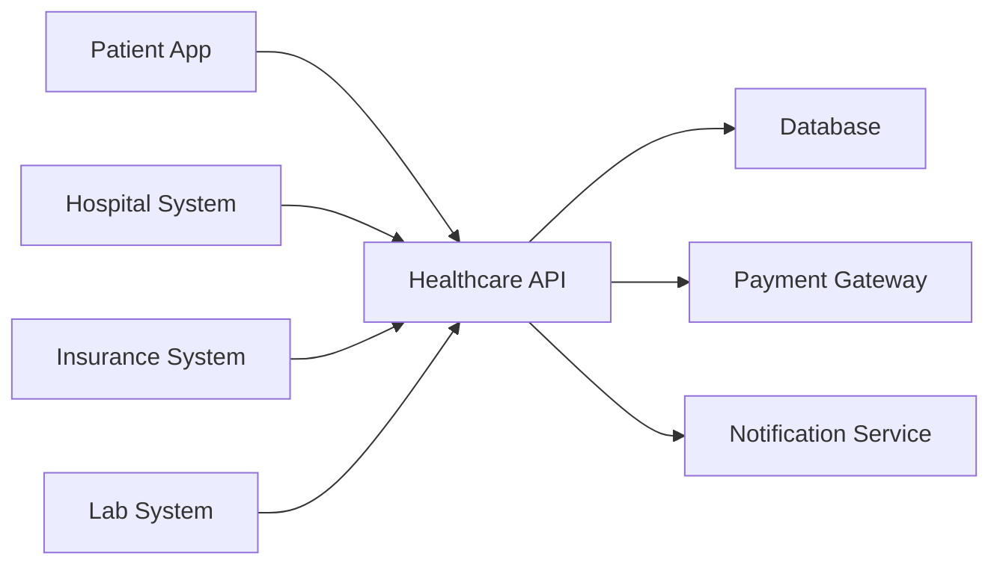
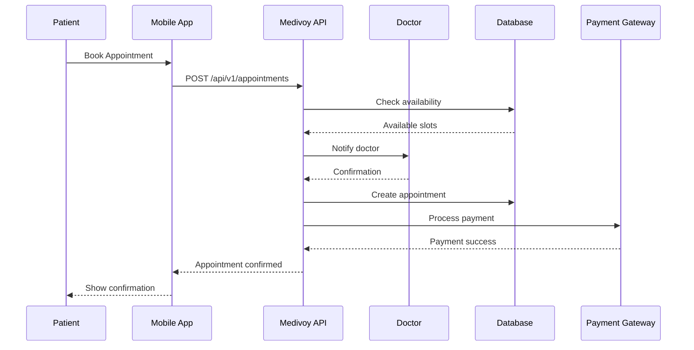
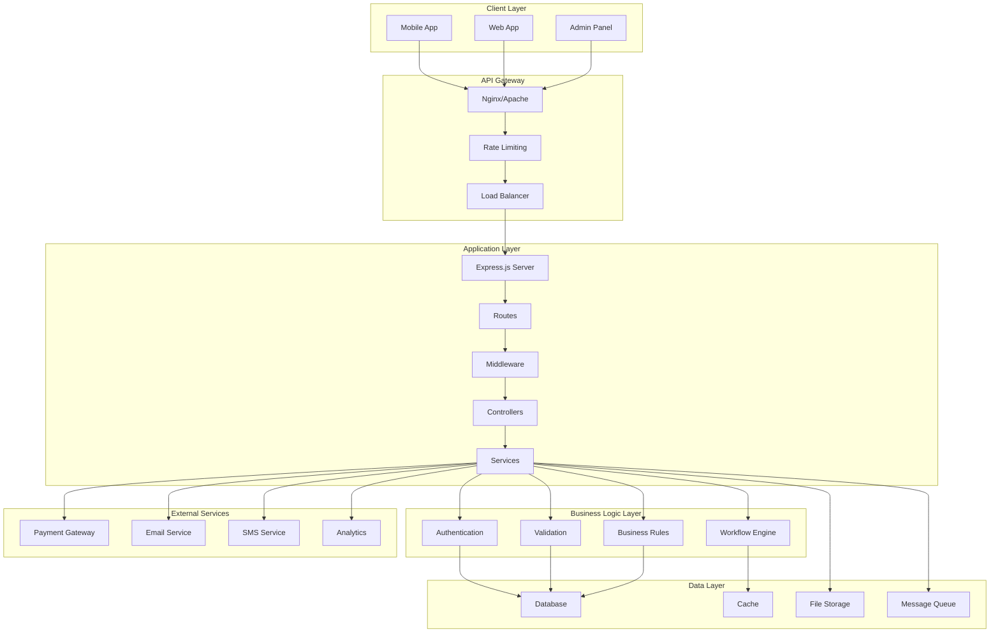
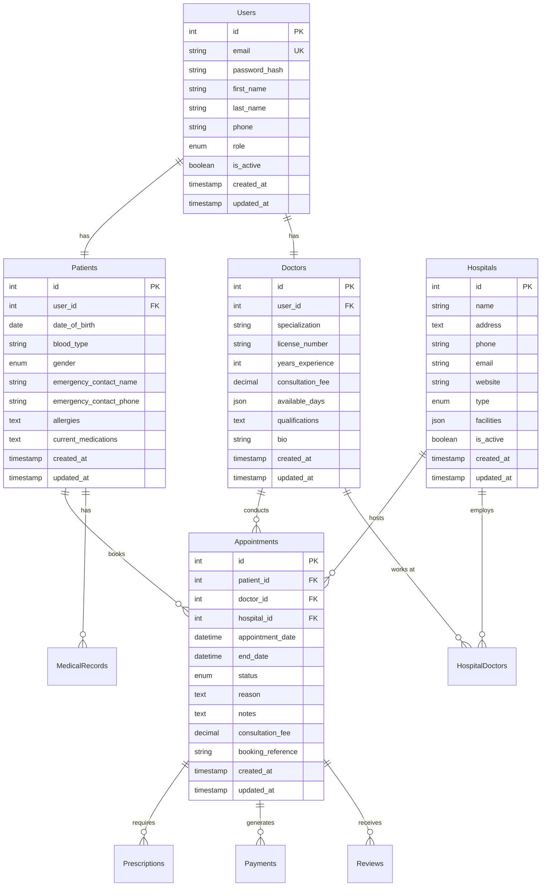
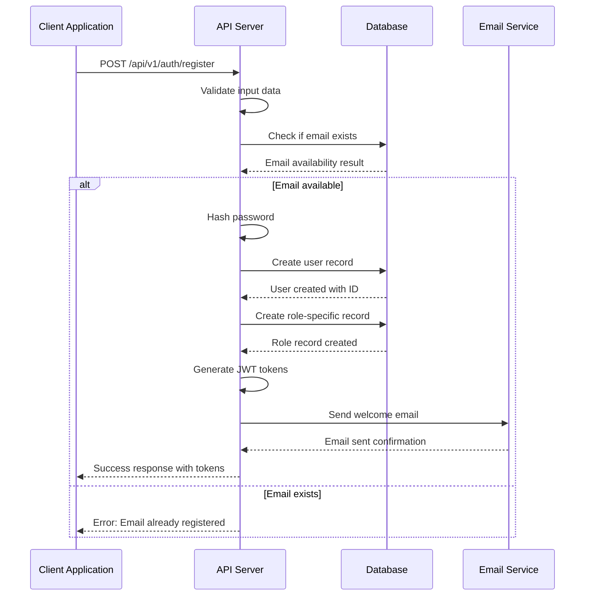
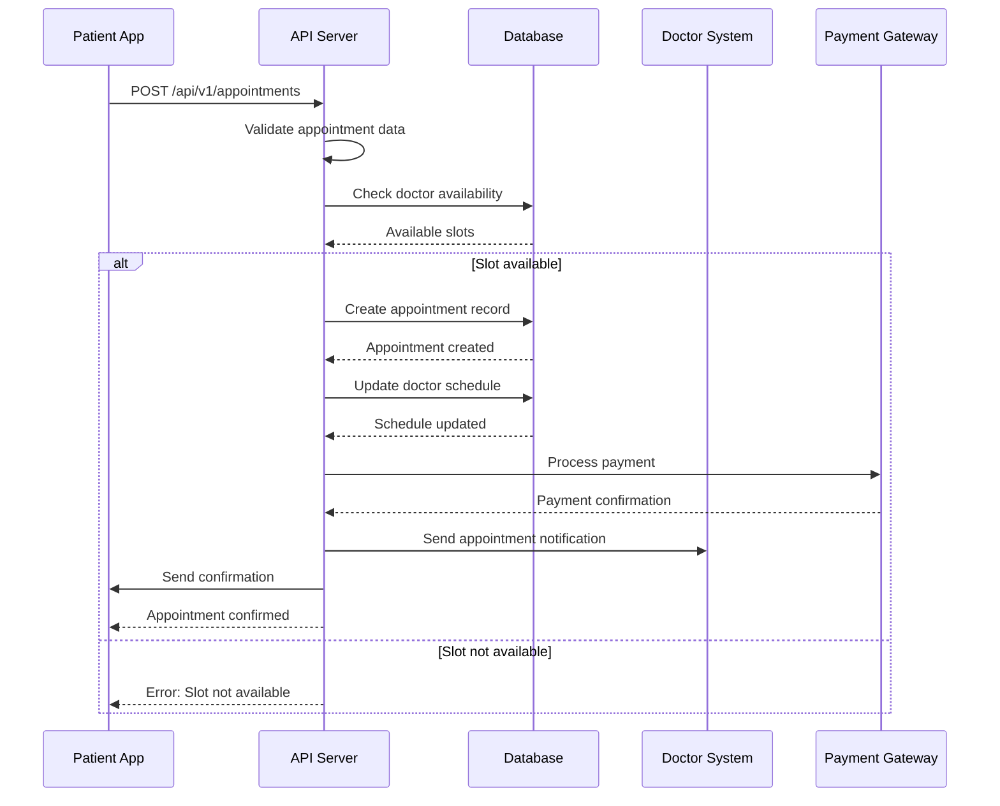
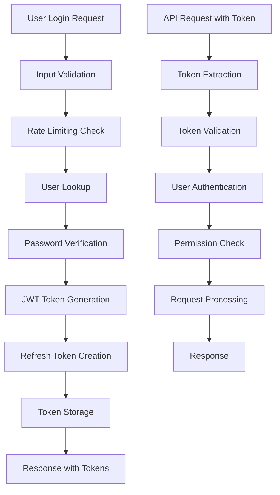
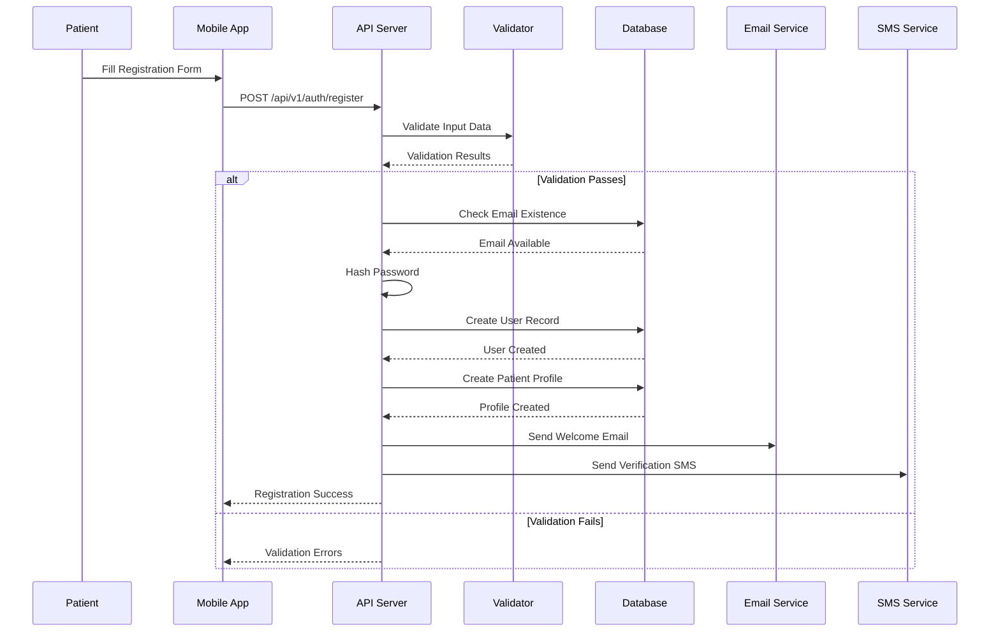

# 🏥 Medivoy Healthcare API - The Ultimate Comprehensive Beginner's Guide

> **📚 The Most Extensive Guide Ever Created for Understanding This Healthcare API Project**
> 
> **🎯 Designed for Absolute Beginners - Zero Prior Knowledge Required**

---

## 📋 **TABLE OF CONTENTS**

1. [🎯 **Introduction to Healthcare APIs**](#introduction-to-healthcare-apis)
2. [🏗️ **Project Architecture Deep Dive**](#project-architecture-deep-dive)
3. [💻 **Development Environment Setup**](#development-environment-setup)
4. [🗄️ **Database Architecture & Workflows**](#database-architecture--workflows)
5. [🔐 **Authentication & Security System**](#authentication--security-system)
6. [📊 **API Design Patterns & Workflows**](#api-design-patterns--workflows)
7. [🏥 **Healthcare Domain Workflows**](#healthcare-domain-workflows)
8. [🔧 **Advanced Features & Integrations**](#advanced-features--integrations)
9. [🧪 **Testing Strategies & Workflows**](#testing-strategies--workflows)
10. [🌐 **Deployment & Production Workflows**](#deployment--production-workflows)
11. [🔍 **Debugging & Troubleshooting**](#debugging--troubleshooting)
12. [📈 **Monitoring & Maintenance**](#monitoring--maintenance)
13. [🚀 **Advanced Customization**](#advanced-customization)
14. [💼 **Real-World Implementation**](#real-world-implementation)
15. [🎓 **Learning Path & Next Steps**](#learning-path--next-steps)

---

## 🎯 **Introduction to Healthcare APIs**

### **🌟 What is a Healthcare API?**

A **Healthcare API** (Application Programming Interface) is a set of rules and protocols that allows different healthcare software systems to communicate with each other. Think of it as a **universal translator** for healthcare applications.



### **🏥 Why the Medivoy Healthcare API?**

The Medivoy Healthcare API is a **complete healthcare management system** that handles:

- **👤 Patient Management** - Registration, records, medical history
- **👨‍⚕️ Doctor Management** - Profiles, schedules, specializations
- **📅 Appointment System** - Booking, scheduling, reminders
- **🏥 Hospital Operations** - Facilities, departments, resources
- **💰 Billing & Payments** - Invoicing, insurance, transactions
- **💊 Prescription Management** - Medications, dosage tracking
- **📊 Analytics** - Reports, insights, business intelligence

### **🔄 Real-World Workflow Example**

Here's how the API works in a real healthcare scenario:



---

## 🏗️ **Project Architecture Deep Dive**

### **📁 Complete Project Structure**

Let's explore every single file and folder in this project and understand what it does:

```
medivoy-backend/
├── 📁 src/                           # Main application source code
│   ├── 📁 controllers/                # Business logic handlers
│   │   ├── auth.controller.js         # Authentication logic
│   │   ├── patient.controller.js      # Patient operations
│   │   ├── doctor.controller.js       # Doctor operations
│   │   ├── appointment.controller.js  # Appointment management
│   │   ├── hospital.controller.js     # Hospital operations
│   │   ├── payment.controller.js      # Payment processing
│   │   ├── prescription.controller.js # Prescription management
│   │   └── [28+ more controllers...]  # All feature controllers
│   ├── 📁 middleware/                 # Security & validation layers
│   │   ├── auth.middleware.js         # JWT authentication
│   │   ├── validation.middleware.js   # Input validation
│   │   ├── rateLimit.middleware.js    # Rate limiting
│   │   ├── error.middleware.js        # Error handling
│   │   └── cors.middleware.js         # Cross-origin requests
│   ├── 📁 models/                     # Database models (blueprints)
│   │   ├── index.js                   # Model associations
│   │   ├── User.model.js              # User base model
│   │   ├── Patient.model.js           # Patient specific fields
│   │   ├── Doctor.model.js            # Doctor specific fields
│   │   ├── Hospital.model.js          # Hospital data structure
│   │   ├── Appointment.model.js       # Appointment relationships
│   │   ├── Prescription.model.js      # Prescription structure
│   │   ├── Payment.model.js           # Payment transactions
│   │   └── [15+ more models...]       # All data models
│   ├── 📁 routes/                     # API endpoints definitions
│   │   ├── index.js                   # Route aggregation
│   │   ├── auth.routes.js             # Authentication endpoints
│   │   ├── patient.routes.js          # Patient endpoints
│   │   ├── doctor.routes.js           # Doctor endpoints
│   │   ├── appointment.routes.js      # Appointment endpoints
│   │   ├── hospital.routes.js         # Hospital endpoints
│   │   ├── payment.routes.js          # Payment endpoints
│   │   └── [20+ more route files...]  # All API routes
│   ├── 📁 services/                   # Complex business operations
│   │   ├── auth.service.js            # Authentication services
│   │   ├── email.service.js           # Email notifications
│   │   ├── sms.service.js             # SMS notifications
│   │   ├── payment.service.js         # Payment processing
│   │   ├── appointment.service.js     # Appointment logic
│   │   ├── notification.service.js    # Notification management
│   │   └── [10+ more services...]     # All business services
│   ├── 📁 utils/                      # Utility functions
│   │   ├── logger.js                  # Logging system
│   │   ├── validator.js               # Validation helpers
│   │   ├── encryption.js              # Data encryption
│   │   ├── helpers.js                 # General utilities
│   │   ├── constants.js               # Application constants
│   │   └── fileUpload.js              # File handling
│   ├── 📁 config/                     # Configuration files
│   │   ├── database.js                # Database configuration
│   │   ├── redis.js                   # Redis configuration
│   │   ├── email.js                   # Email service config
│   │   ├── payment.js                 # Payment gateway config
│   │   ├── swagger.js                 # API documentation config
│   │   └── index.js                   # Config aggregation
│   ├── 📁 validators/                 # Request validation schemas
│   │   ├── auth.validator.js          # Auth request validation
│   │   ├── patient.validator.js       # Patient data validation
│   │   ├── appointment.validator.js   # Appointment validation
│   │   └── [15+ more validators...]   # All validation schemas
│   ├── 📁 migrations/                 # Database migration files
│   │   ├── 001-create-users.js        # Create users table
│   │   ├── 002-create-patients.js     # Create patients table
│   │   ├── 003-create-doctors.js      # Create doctors table
│   │   ├── [50+ migration files...]   # All database migrations
│   ├── 📁 seeders/                    # Database seed data
│   │   ├── 001-admin-user.js          # Create admin user
│   │   ├── 002-sample-hospitals.js    # Sample hospital data
│   │   ├── 003-sample-doctors.js      # Sample doctor data
│   │   └── [20+ seeder files...]      # All sample data
│   ├── 📄 app.js                      # Express app configuration
│   ├── 📄 server.js                   # Server startup file
│   └── 📄 index.js                    # Application entry point
├── 📁 tests/                          # Test files
│   ├── unit/                          # Unit tests
│   ├── integration/                   # Integration tests
│   └── e2e/                           # End-to-end tests
├── 📁 docs/                           # Documentation files
│   ├── api/                           # API documentation
│   ├── deployment/                    # Deployment guides
│   └── architecture/                  # Architecture docs
├── 📁 uploads/                        # File upload storage
├── 📁 logs/                           # Application logs
├── 📄 package.json                    # Dependencies & scripts
├── 📄 .env.example                    # Environment template
├── 📄 .env                            # Environment variables (secret)
├── 📄 .gitignore                      # Git ignore rules
├── 📄 .sequelizerc                    # Sequelize configuration
├── 📄 README.md                       # Project documentation
├── 📄 MEDIVOY_BACKEND_COMPLETE_BEGINNER_GUIDE.md  # This guide
├── 📄 COMPLETE_API_DOCUMENTATION.md   # API reference
├── 📄 ENHANCED_OPENAPI_SPEC.json      # OpenAPI specification
└── 📄 ENHANCED_POSTMAN_COLLECTION.json # Postman collection
```

### **🔗 How Everything Connects - Data Flow Architecture**



### **🎯 Core Design Principles**

#### **1. Layered Architecture**
The project follows a **layered architecture pattern**:

```
📱 Presentation Layer (Mobile/Web Apps)
        ↓
🔌 API Layer (REST Endpoints)
        ↓
⚙️ Business Logic Layer (Services & Controllers)
        ↓
🗄️ Data Access Layer (Models & Database)
        ↓
💾 Storage Layer (Database, Cache, Files)
```

#### **2. Separation of Concerns**
Each component has a single responsibility:

- **Controllers** - Handle HTTP requests and responses
- **Services** - Contain business logic and workflows
- **Models** - Define data structure and relationships
- **Middleware** - Handle cross-cutting concerns (auth, validation)
- **Routes** - Define API endpoints and URL structure

#### **3. Modular Design**
The application is organized into modules:

```
👤 User Management Module
├── Authentication
├── User Profiles
├── Role Management
└── Permissions

🏥 Healthcare Module  
├── Patients
├── Doctors
├── Hospitals
└── Appointments

💰 Business Module
├── Payments
├── Invoices
├── Insurance
└── Subscriptions

🔧 System Module
├── Analytics
├── Notifications
├── File Management
└── Administration
```

---

## 💻 **Development Environment Setup**

### **🎯 Complete Setup Workflow**

#### **Phase 1: System Requirements**

**🔧 Essential Software Installation:**

1. **Node.js Runtime**
```bash
# Why Node.js? JavaScript runtime for server-side development
# Download: https://nodejs.org/
# Version: 18.x or 20.x (LTS recommended)

# Installation verification:
node --version    # Should show v18.x.x or v20.x.x
npm --version     # Should show 9.x.x or 10.x.x

# What this does:
# - Node.js executes JavaScript code outside the browser
# - npm (Node Package Manager) manages project dependencies
# - LTS = Long Term Support (stable version)
```

2. **Git Version Control**
```bash
# Why Git? Track changes, collaborate with others
# Download: https://git-scm.com/

# Installation verification:
git --version    # Should show git version 2.x.x

# Basic configuration:
git config --global user.name "Your Name"
git config --global user.email "your.email@example.com"

# What this does:
# - Git tracks changes to your code over time
# - Enables collaboration with other developers
# - Allows you to revert to previous versions if needed
```

3. **Code Editor**
```bash
# Recommended: Visual Studio Code
# Download: https://code.visualstudio.com/

# Essential VS Code Extensions:
# - ES7+ React/Redux/React-Native snippets
# - Prettier - Code formatter
# - ESLint - JavaScript linting
# - Thunder Client - API testing
# - GitLens - Git integration
# - Auto Rename Tag
# - Bracket Pair Colorizer
# - Material Icon Theme
# - One Dark Pro theme

# Why a good editor matters:
# - Syntax highlighting for better code readability
# - Auto-completion to write code faster
# - Debugging tools to find and fix errors
# - Integrated terminal for command-line operations
```

4. **Database (Choose ONE)**

**Option A: PostgreSQL (Recommended for Production)**
```bash
# Why PostgreSQL? Robust, scalable, feature-rich
# Download: https://www.postgresql.org/download/

# Installation (Ubuntu/Debian):
sudo apt update
sudo apt install postgresql postgresql-contrib

# Installation (Mac):
brew install postgresql
brew services start postgresql

# Installation (Windows):
# Download installer from postgresql.org

# Create database and user:
sudo -u postgres psql
CREATE DATABASE medivoy_dev;
CREATE USER medivoy_user WITH PASSWORD 'your_secure_password';
GRANT ALL PRIVILEGES ON DATABASE medivoy_dev TO medivoy_user;
\q

# What this does:
# - PostgreSQL is a powerful relational database
# - Creates a dedicated database for our application
# - Sets up a user with appropriate permissions
# - Production-ready with advanced features
```

**Option B: SQLite (Easiest for Development)**
```bash
# Why SQLite? No installation required, file-based
# Perfect for beginners and local development

# No installation needed! SQLite comes built-in
# The database will be created as a single file: database.sqlite

# What this does:
# - SQLite stores the entire database in a single file
# - No separate database server needed
# - Perfect for development and testing
# - Easy to backup and migrate
```

#### **Phase 2: Project Setup**

**1. Clone the Repository**
```bash
# Clone the project to your local machine:
git clone https://github.com/MyTimeToShine777/medivoy-backend.git

# Navigate to the project directory:
cd medivoy-backend

# What you're doing:
# - Creating a local copy of the project
# - Moving into the project folder
# - This is where all your work will happen

# Explore the project structure:
ls -la                    # List all files and folders
tree                     # Show directory structure (if tree is installed)
```

**2. Install Dependencies**
```bash
# Install all required packages:
npm install

# What this does:
# - Reads package.json for dependency list
# - Downloads all required packages
# - Creates node_modules folder with all libraries
# - This might take 5-10 minutes the first time

# Understanding package.json:
cat package.json

# Key sections to understand:
# - dependencies: Packages needed for production
# - devDependencies: Packages needed only for development
# - scripts: Commands to run common tasks
# - engines: Required Node.js version
```

**3. Environment Configuration**
```bash
# Copy the environment template:
cp .env.example .env

# Edit the environment file:
# On Mac/Linux: nano .env
# On Windows: notepad .env
# Or use VS Code: code .env

# What this does:
# - Creates a copy of the environment template
# - .env file contains configuration variables
# - NEVER commit .env file to version control (contains secrets)
```

**4. Configure Your Environment**

**For SQLite Development:**
```env
# Application Configuration
NODE_ENV=development
PORT=3000
API_VERSION=v1
APP_NAME=Medivoy Healthcare System

# Database Configuration (SQLite)
DB_DIALECT=sqlite
DB_STORAGE=./database.sqlite

# JWT Configuration (Security)
JWT_SECRET=your_super_secret_jwt_key_change_this_in_production_minimum_64_chars
JWT_EXPIRE=7d
JWT_REFRESH_SECRET=your_refresh_token_secret_change_this_minimum_64_chars
JWT_REFRESH_EXPIRE=30d

# Optional Services (comment out if not using)
# REDIS_HOST=localhost
# REDIS_PORT=6379
# REDIS_PASSWORD=
```

**For PostgreSQL Development:**
```env
# Application Configuration
NODE_ENV=development
PORT=3000
API_VERSION=v1
APP_NAME=Medivoy Healthcare System

# Database Configuration (PostgreSQL)
DB_DIALECT=postgresql
DB_HOST=localhost
DB_PORT=5432
DB_NAME=medivoy_dev
DB_USER=medivoy_user
DB_PASSWORD=your_secure_password
DB_SSL=false

# JWT Configuration (Security)
JWT_SECRET=your_super_secret_jwt_key_change_this_in_production_minimum_64_chars
JWT_EXPIRE=7d
JWT_REFRESH_SECRET=your_refresh_token_secret_change_this_minimum_64_chars
JWT_REFRESH_EXPIRE=30d
```

**5. Database Setup**
```bash
# Run database migrations (create tables):
npm run db:migrate

# What this does:
# - Reads migration files from src/migrations/
# - Creates database tables based on model definitions
# - Sets up table relationships and indexes
# - Creates the complete database schema

# Insert sample data (optional but recommended):
npm run db:seed

# What this does:
# - Runs seeder files from src/seeders/
# - Inserts sample data for testing
# - Creates admin users, sample hospitals, doctors, etc.
# - Makes the application usable immediately
```

**6. Start the Development Server**
```bash
# Start the application:
npm start

# What this happens:
# - Starts the Node.js server
# - Connects to the database
# - Loads all API endpoints
# - Starts the application on the configured port

# You should see output like:
# 🚀 Server running on port 3000
# 🗄️ Database connected successfully
# 📚 Swagger documentation available at http://localhost:3000/api-docs
# ❤️ Health check: http://localhost:3000/health
```

#### **Phase 3: Verification**

**1. Test the Server**
```bash
# Test health endpoint (in new terminal):
curl http://localhost:3000/health

# Expected response:
{
  "status": "ok",
  "timestamp": "2024-01-15T10:00:00.000Z",
  "uptime": 123.456,
  "environment": "development",
  "message": "Medivoy Healthcare API is running"
}
```

**2. Access Swagger Documentation**
```bash
# Open your browser and go to:
http://localhost:3000/api-docs

# What you'll see:
# - Interactive API documentation
# - All 288 endpoints listed
# - Try-it-out functionality for testing
# - Request/response examples
```

**3. Test API Endpoints**
```bash
# Test user registration:
curl -X POST http://localhost:3000/api/v1/auth/register \
  -H "Content-Type: application/json" \
  -d '{
    "firstName": "John",
    "lastName": "Doe",
    "email": "john@example.com",
    "password": "TestPassword123!",
    "role": "patient"
  }'

# Expected response:
{
  "success": true,
  "message": "User registered successfully",
  "data": {
    "user": {
      "id": 1,
      "email": "john@example.com",
      "firstName": "John",
      "lastName": "Doe",
      "role": "patient"
    },
    "token": "eyJhbGciOiJIUzI1NiIsInR5cCI6IkpXVCJ9..."
  }
}
```

---

## 🗄️ **Database Architecture & Workflows**

### **🏗️ Database Design Philosophy**

The Medivoy Healthcare API uses a **relational database design** with the following principles:

#### **1. Normalization**
- **First Normal Form (1NF):** No repeating groups
- **Second Normal Form (2NF):** No partial dependencies
- **Third Normal Form (3NF):** No transitive dependencies

#### **2. Relationship Types**
- **One-to-One:** User ↔ Patient/Doctor
- **One-to-Many:** Doctor ↔ Appointments
- **Many-to-Many:** Doctors ↔ Hospitals

#### **3. Data Integrity**
- **Primary Keys:** Unique identifiers for each record
- **Foreign Keys:** Maintain relationships between tables
- **Constraints:** Ensure data validity
- **Indexes:** Optimize query performance

### **📊 Complete Database Schema**

#### **Core Entity Relationships**



### **🔄 Database Workflow Patterns**

#### **1. User Registration Workflow**



#### **2. Appointment Booking Workflow**



### **🗃️ Table-by-Table Explanation**

#### **1. Users Table - The Foundation**

```sql
CREATE TABLE Users (
    id INTEGER PRIMARY KEY AUTO_INCREMENT,
    email VARCHAR(255) UNIQUE NOT NULL,
    password_hash VARCHAR(255) NOT NULL,
    first_name VARCHAR(100) NOT NULL,
    last_name VARCHAR(100) NOT NULL,
    phone VARCHAR(20),
    role ENUM('patient', 'doctor', 'admin', 'hospital_admin') NOT NULL,
    is_active BOOLEAN DEFAULT true,
    email_verified BOOLEAN DEFAULT false,
    last_login TIMESTAMP NULL,
    created_at TIMESTAMP DEFAULT CURRENT_TIMESTAMP,
    updated_at TIMESTAMP DEFAULT CURRENT_TIMESTAMP ON UPDATE CURRENT_TIMESTAMP,
    
    -- Indexes for performance
    INDEX idx_email (email),
    INDEX idx_role (role),
    INDEX idx_active (is_active),
    INDEX idx_created_at (created_at)
);
```

**Why this design:**
- **id:** Auto-incrementing primary key for uniqueness
- **email:** Unique identifier for user login
- **password_hash:** Never store plain text passwords
- **role:** User type determines permissions
- **is_active:** Soft delete capability
- **indexes:** Speed up common queries

#### **2. Patients Table - Patient-Specific Data**

```sql
CREATE TABLE Patients (
    id INTEGER PRIMARY KEY AUTO_INCREMENT,
    user_id INTEGER UNIQUE NOT NULL,
    date_of_birth DATE,
    blood_type ENUM('A+', 'A-', 'B+', 'B-', 'AB+', 'AB-', 'O+', 'O-'),
    gender ENUM('male', 'female', 'other'),
    height DECIMAL(5,2), -- in centimeters
    weight DECIMAL(5,2), -- in kilograms
    emergency_contact_name VARCHAR(100),
    emergency_contact_phone VARCHAR(20),
    allergies TEXT, -- JSON array of allergies
    current_medications TEXT, -- JSON array of medications
    medical_history TEXT, -- JSON array of medical conditions
    insurance_provider VARCHAR(100),
    insurance_policy_number VARCHAR(50),
    created_at TIMESTAMP DEFAULT CURRENT_TIMESTAMP,
    updated_at TIMESTAMP DEFAULT CURRENT_TIMESTAMP ON UPDATE CURRENT_TIMESTAMP,
    
    -- Foreign key constraint
    FOREIGN KEY (user_id) REFERENCES Users(id) ON DELETE CASCADE,
    
    -- Indexes
    INDEX idx_user_id (user_id),
    INDEX idx_blood_type (blood_type),
    INDEX idx_date_of_birth (date_of_birth)
);
```

**Why this design:**
- **user_id:** One-to-one relationship with Users table
- **medical data fields:** Comprehensive patient health information
- **JSON fields:** Flexible storage for lists of allergies/medications
- **insurance fields:** Billing and claim processing

#### **3. Doctors Table - Professional Information**

```sql
CREATE TABLE Doctors (
    id INTEGER PRIMARY KEY AUTO_INCREMENT,
    user_id INTEGER UNIQUE NOT NULL,
    specialization VARCHAR(100) NOT NULL,
    license_number VARCHAR(50) UNIQUE NOT NULL,
    years_experience INTEGER DEFAULT 0,
    consultation_fee DECIMAL(10,2) DEFAULT 0.00,
    available_days JSON, -- ["Monday", "Tuesday", "Wednesday", ...]
    available_time_start TIME DEFAULT '09:00:00',
    available_time_end TIME DEFAULT '17:00:00',
    consultation_duration INTEGER DEFAULT 30, -- minutes
    qualifications TEXT, -- JSON array of degrees and certifications
    bio TEXT,
    profile_image_url VARCHAR(255),
    rating DECIMAL(3,2) DEFAULT 0.00,
    total_reviews INTEGER DEFAULT 0,
    is_verified BOOLEAN DEFAULT false,
    verification_document_url VARCHAR(255),
    created_at TIMESTAMP DEFAULT CURRENT_TIMESTAMP,
    updated_at TIMESTAMP DEFAULT CURRENT_TIMESTAMP ON UPDATE CURRENT_TIMESTAMP,
    
    -- Foreign key constraint
    FOREIGN KEY (user_id) REFERENCES Users(id) ON DELETE CASCADE,
    
    -- Indexes
    INDEX idx_user_id (user_id),
    INDEX idx_specialization (specialization),
    INDEX idx_license_number (license_number),
    INDEX idx_rating (rating),
    INDEX idx_verified (is_verified)
);
```

**Why this design:**
- **specialization:** Medical specialty for categorization
- **license_number:** Professional verification
- **availability:** Scheduling and booking logic
- **rating/reviews:** Quality metrics for patients
- **verification:** Professional credential verification

#### **4. Appointments Table - Core Business Logic**

```sql
CREATE TABLE Appointments (
    id INTEGER PRIMARY KEY AUTO_INCREMENT,
    patient_id INTEGER NOT NULL,
    doctor_id INTEGER NOT NULL,
    hospital_id INTEGER NOT NULL,
    appointment_date DATETIME NOT NULL,
    end_date DATETIME NOT NULL,
    status ENUM('scheduled', 'confirmed', 'in_progress', 'completed', 'cancelled', 'no_show') DEFAULT 'scheduled',
    reason TEXT NOT NULL,
    notes TEXT,
    consultation_fee DECIMAL(10,2),
    payment_status ENUM('pending', 'paid', 'refunded', 'failed') DEFAULT 'pending',
    payment_id INTEGER NULL,
    booking_reference VARCHAR(50) UNIQUE NOT NULL,
    cancellation_reason TEXT,
    cancelled_by ENUM('patient', 'doctor', 'admin', 'system') NULL,
    cancellation_date DATETIME NULL,
    reminder_sent BOOLEAN DEFAULT false,
    follow_up_required BOOLEAN DEFAULT false,
    follow_up_date DATETIME NULL,
    created_at TIMESTAMP DEFAULT CURRENT_TIMESTAMP,
    updated_at TIMESTAMP DEFAULT CURRENT_TIMESTAMP ON UPDATE CURRENT_TIMESTAMP,
    
    -- Foreign key constraints
    FOREIGN KEY (patient_id) REFERENCES Patients(id) ON DELETE RESTRICT,
    FOREIGN KEY (doctor_id) REFERENCES Doctors(id) ON DELETE RESTRICT,
    FOREIGN KEY (hospital_id) REFERENCES Hospitals(id) ON DELETE RESTRICT,
    FOREIGN KEY (payment_id) REFERENCES Payments(id) ON DELETE SET NULL,
    
    -- Indexes for performance
    INDEX idx_patient_id (patient_id),
    INDEX idx_doctor_id (doctor_id),
    INDEX idx_hospital_id (hospital_id),
    INDEX idx_appointment_date (appointment_date),
    INDEX idx_status (status),
    INDEX idx_payment_status (payment_status),
    INDEX idx_booking_reference (booking_reference),
    
    -- Composite indexes for common queries
    INDEX idx_patient_status (patient_id, status),
    INDEX idx_doctor_date (doctor_id, appointment_date),
    INDEX idx_hospital_date (hospital_id, appointment_date)
);
```

**Why this design:**
- **status tracking:** Complete appointment lifecycle
- **payment integration:** Financial transaction linking
- **cancellation workflow:** Track who cancelled and why
- **reminder system:** Automated notification tracking
- **follow-up care:** Patient care continuity

### **🔍 Advanced Database Features**

#### **1. Database Migrations**

Migrations are version control for your database:

```javascript
// Example migration: 001-create-users.js
module.exports = {
  up: async (queryInterface, Sequelize) => {
    // Create the table
    await queryInterface.createTable('Users', {
      id: {
        allowNull: false,
        autoIncrement: true,
        primaryKey: true,
        type: Sequelize.INTEGER
      },
      email: {
        type: Sequelize.STRING(255),
        allowNull: false,
        unique: true,
        validate: {
          isEmail: true
        }
      },
      password_hash: {
        type: Sequelize.STRING(255),
        allowNull: false
      },
      first_name: {
        type: Sequelize.STRING(100),
        allowNull: false
      },
      last_name: {
        type: Sequelize.STRING(100),
        allowNull: false
      },
      role: {
        type: Sequelize.ENUM('patient', 'doctor', 'admin', 'hospital_admin'),
        allowNull: false
      },
      is_active: {
        type: Sequelize.BOOLEAN,
        defaultValue: true
      },
      created_at: {
        allowNull: false,
        type: Sequelize.DATE
      },
      updated_at: {
        allowNull: false,
        type: Sequelize.DATE
      }
    });

    // Create indexes
    await queryInterface.addIndex('Users', ['email']);
    await queryInterface.addIndex('Users', ['role']);
    await queryInterface.addIndex('Users', ['is_active']);
  },

  down: async (queryInterface, Sequelize) => {
    // Drop the table
    await queryInterface.dropTable('Users');
  }
};
```

#### **2. Database Seeders**

Seeders populate your database with initial data:

```javascript
// Example seeder: 001-admin-user.js
module.exports = {
  up: async (queryInterface, Sequelize) => {
    const bcrypt = require('bcryptjs');
    const hashedPassword = await bcrypt.hash('admin123', 12);

    await queryInterface.bulkInsert('Users', [{
      email: 'admin@medivoy.com',
      password_hash: hashedPassword,
      first_name: 'System',
      last_name: 'Administrator',
      role: 'admin',
      is_active: true,
      created_at: new Date(),
      updated_at: new Date()
    }]);
  },

  down: async (queryInterface, Sequelize) => {
    await queryInterface.bulkDelete('Users', {
      email: 'admin@medivoy.com'
    });
  }
};
```

#### **3. Database Relationships**

```javascript
// Example model relationships in models/index.js
const User = require('./User.model');
const Patient = require('./Patient.model');
const Doctor = require('./Doctor.model');
const Appointment = require('./Appointment.model');

// Define relationships
User.hasOne(Patient, { foreignKey: 'user_id', as: 'patientProfile' });
Patient.belongsTo(User, { foreignKey: 'user_id', as: 'user' });

User.hasOne(Doctor, { foreignKey: 'user_id', as: 'doctorProfile' });
Doctor.belongsTo(User, { foreignKey: 'user_id', as: 'user' });

Patient.hasMany(Appointment, { foreignKey: 'patient_id', as: 'appointments' });
Appointment.belongsTo(Patient, { foreignKey: 'patient_id', as: 'patient' });

Doctor.hasMany(Appointment, { foreignKey: 'doctor_id', as: 'appointments' });
Appointment.belongsTo(Doctor, { foreignKey: 'doctor_id', as: 'doctor' });

// Many-to-Many relationship: Doctors ↔ Hospitals
const HospitalDoctor = require('./HospitalDoctor.model');
Doctor.belongsToMany(Hospital, { 
  through: HospitalDoctor, 
  foreignKey: 'doctor_id',
  otherKey: 'hospital_id',
  as: 'hospitals'
});
Hospital.belongsToMany(Doctor, { 
  through: HospitalDoctor, 
  foreignKey: 'hospital_id',
  otherKey: 'doctor_id',
  as: 'doctors'
});
```

---

## 🔐 **Authentication & Security System**

### **🔑 Authentication Architecture Overview**

The Medivoy Healthcare API uses a **JWT-based authentication system** with the following security layers:



### **🔒 Complete Authentication Workflow**

#### **1. User Registration Process**

```javascript
// src/controllers/auth.controller.js - Registration workflow
exports.register = async (req, res) => {
  try {
    // Step 1: Input validation
    const { error } = validateRegistration(req.body);
    if (error) {
      return res.status(400).json({
        success: false,
        message: 'Validation failed',
        errors: error.details
      });
    }

    const { firstName, lastName, email, password, role } = req.body;

    // Step 2: Check if user already exists
    const existingUser = await User.findOne({ where: { email } });
    if (existingUser) {
      return res.status(409).json({
        success: false,
        message: 'Email already registered'
      });
    }

    // Step 3: Hash password with bcrypt
    const saltRounds = 12;
    const hashedPassword = await bcrypt.hash(password, saltRounds);

    // Step 4: Create user transaction
    const result = await sequelize.transaction(async (t) => {
      // Create base user
      const user = await User.create({
        firstName,
        lastName,
        email,
        passwordHash: hashedPassword,
        role,
        isActive: true,
        emailVerified: false
      }, { transaction: t });

      // Create role-specific profile
      if (role === 'patient') {
        await Patient.create({
          userId: user.id
        }, { transaction: t });
      } else if (role === 'doctor') {
        await Doctor.create({
          userId: user.id,
          specialization: 'General Practitioner', // Default
          licenseNumber: 'TEMP-' + Date.now(), // Temporary
          yearsExperience: 0
        }, { transaction: t });
      }

      return user;
    });

    // Step 5: Generate JWT tokens
    const tokens = generateTokens(result);

    // Step 6: Send welcome email (async, non-blocking)
    emailService.sendWelcomeEmail(result.email, result.firstName);

    // Step 7: Return success response
    res.status(201).json({
      success: true,
      message: 'User registered successfully',
      data: {
        user: {
          id: result.id,
          email: result.email,
          firstName: result.firstName,
          lastName: result.lastName,
          role: result.role
        },
        ...tokens
      }
    });

  } catch (error) {
    console.error('Registration error:', error);
    res.status(500).json({
      success: false,
      message: 'Registration failed',
      error: process.env.NODE_ENV === 'development' ? error.message : undefined
    });
  }
};
```

#### **2. User Login Process**

```javascript
// src/controllers/auth.controller.js - Login workflow
exports.login = async (req, res) => {
  try {
    // Step 1: Input validation
    const { error } = validateLogin(req.body);
    if (error) {
      return res.status(400).json({
        success: false,
        message: 'Validation failed',
        errors: error.details
      });
    }

    const { email, password } = req.body;

    // Step 2: Rate limiting check
    const rateLimitKey = `login_attempts:${email}`;
    const attempts = await redis.get(rateLimitKey);
    
    if (attempts && parseInt(attempts) >= 5) {
      return res.status(429).json({
        success: false,
        message: 'Too many login attempts. Please try again later.'
      });
    }

    // Step 3: Find user with profile
    const user = await User.findOne({
      where: { email, isActive: true },
      include: [
        { model: Patient, as: 'patientProfile' },
        { model: Doctor, as: 'doctorProfile' }
      ]
    });

    if (!user) {
      // Increment failed attempts
      await redis.incr(rateLimitKey);
      await redis.expire(rateLimitKey, 900); // 15 minutes
      
      return res.status(401).json({
        success: false,
        message: 'Invalid email or password'
      });
    }

    // Step 4: Verify password
    const isPasswordValid = await bcrypt.compare(password, user.passwordHash);
    if (!isPasswordValid) {
      // Increment failed attempts
      await redis.incr(rateLimitKey);
      await redis.expire(rateLimitKey, 900); // 15 minutes
      
      return res.status(401).json({
        success: false,
        message: 'Invalid email or password'
      });
    }

    // Step 5: Clear failed attempts on successful login
    await redis.del(rateLimitKey);

    // Step 6: Update last login
    await user.update({ lastLogin: new Date() });

    // Step 7: Generate JWT tokens
    const tokens = generateTokens(user);

    // Step 8: Log successful login
    logger.info('User logged in', {
      userId: user.id,
      email: user.email,
      ip: req.ip,
      userAgent: req.get('User-Agent')
    });

    // Step 9: Return success response
    res.json({
      success: true,
      message: 'Login successful',
      data: {
        user: {
          id: user.id,
          email: user.email,
          firstName: user.firstName,
          lastName: user.lastName,
          role: user.role,
          profile: user.patientProfile || user.doctorProfile
        },
        ...tokens
      }
    });

  } catch (error) {
    console.error('Login error:', error);
    res.status(500).json({
      success: false,
      message: 'Login failed',
      error: process.env.NODE_ENV === 'development' ? error.message : undefined
    });
  }
};
```

#### **3. JWT Token Generation**

```javascript
// src/utils/jwt.js - Token generation and validation
const jwt = require('jsonwebtoken');

class JWTService {
  constructor() {
    this.accessTokenSecret = process.env.JWT_SECRET;
    this.refreshTokenSecret = process.env.JWT_REFRESH_SECRET;
    this.accessTokenExpiry = process.env.JWT_EXPIRE || '15m';
    this.refreshTokenExpiry = process.env.JWT_REFRESH_EXPIRE || '7d';
  }

  // Generate access and refresh tokens
  generateTokens(user) {
    const payload = {
      id: user.id,
      email: user.email,
      role: user.role,
      firstName: user.firstName,
      lastName: user.lastName
    };

    const accessToken = jwt.sign(payload, this.accessTokenSecret, {
      expiresIn: this.accessTokenExpiry,
      issuer: 'medivoy-api',
      audience: 'medivoy-client'
    });

    const refreshToken = jwt.sign(
      { id: user.id, type: 'refresh' },
      this.refreshTokenSecret,
      {
        expiresIn: this.refreshTokenExpiry,
        issuer: 'medivoy-api',
        audience: 'medivoy-client'
      }
    );

    return {
      accessToken,
      refreshToken,
      tokenType: 'Bearer',
      expiresIn: this.parseExpiry(this.accessTokenExpiry)
    };
  }

  // Verify access token
  verifyAccessToken(token) {
    try {
      return jwt.verify(token, this.accessTokenSecret, {
        issuer: 'medivoy-api',
        audience: 'medivoy-client'
      });
    } catch (error) {
      throw new Error('Invalid access token');
    }
  }

  // Verify refresh token
  verifyRefreshToken(token) {
    try {
      const decoded = jwt.verify(token, this.refreshTokenSecret, {
        issuer: 'medivoy-api',
        audience: 'medivoy-client'
      });

      if (decoded.type !== 'refresh') {
        throw new Error('Invalid token type');
      }

      return decoded;
    } catch (error) {
      throw new Error('Invalid refresh token');
    }
  }

  // Refresh access token
  async refreshAccessToken(refreshToken) {
    try {
      // Verify refresh token
      const decoded = this.verifyRefreshToken(refreshToken);

      // Find user
      const user = await User.findByPk(decoded.id, {
        attributes: ['id', 'email', 'role', 'firstName', 'lastName', 'isActive']
      });

      if (!user || !user.isActive) {
        throw new Error('User not found or inactive');
      }

      // Generate new tokens
      return this.generateTokens(user);
    } catch (error) {
      throw new Error('Token refresh failed');
    }
  }

  // Parse expiry time to seconds
  parseExpiry(expiry) {
    const units = {
      's': 1,
      'm': 60,
      'h': 3600,
      'd': 86400
    };

    const match = expiry.match(/^(\d+)([smhd])$/);
    if (match) {
      const [, amount, unit] = match;
      return parseInt(amount) * units[unit];
    }

    return 900; // Default 15 minutes
  }
}

module.exports = new JWTService();
```

#### **4. Authentication Middleware**

```javascript
// src/middleware/auth.middleware.js - Request authentication
const jwtService = require('../utils/jwt');
const User = require('../models/User.model');

const authenticate = async (req, res, next) => {
  try {
    // Step 1: Extract token from header
    const authHeader = req.header('Authorization');
    if (!authHeader || !authHeader.startsWith('Bearer ')) {
      return res.status(401).json({
        success: false,
        message: 'Access token required'
      });
    }

    const token = authHeader.substring(7); // Remove 'Bearer ' prefix

    // Step 2: Verify token
    const decoded = jwtService.verifyAccessToken(token);

    // Step 3: Find user in database
    const user = await User.findByPk(decoded.id, {
      attributes: ['id', 'email', 'role', 'firstName', 'lastName', 'isActive', 'lastLogin'],
      include: [
        { model: Patient, as: 'patientProfile' },
        { model: Doctor, as: 'doctorProfile' }
      ]
    });

    if (!user || !user.isActive) {
      return res.status(401).json({
        success: false,
        message: 'Invalid token or user inactive'
      });
    }

    // Step 4: Attach user to request object
    req.user = user;
    req.token = token;

    // Step 5: Continue to next middleware/route
    next();

  } catch (error) {
    console.error('Authentication error:', error);
    
    if (error.name === 'TokenExpiredError') {
      return res.status(401).json({
        success: false,
        message: 'Token expired',
        code: 'TOKEN_EXPIRED'
      });
    }

    if (error.name === 'JsonWebTokenError') {
      return res.status(401).json({
        success: false,
        message: 'Invalid token'
      });
    }

    res.status(401).json({
      success: false,
      message: 'Authentication failed'
    });
  }
};

// Role-based authorization middleware
const authorize = (...roles) => {
  return (req, res, next) => {
    if (!req.user) {
      return res.status(401).json({
        success: false,
        message: 'Authentication required'
      });
    }

    if (!roles.includes(req.user.role)) {
      return res.status(403).json({
        success: false,
        message: 'Insufficient permissions',
        required: roles,
        current: req.user.role
      });
    }

    next();
  };
};

// Resource owner authorization
const authorizeOwner = (resourceIdParam = 'id', resourceModel) => {
  return async (req, res, next) => {
    try {
      const resourceId = req.params[resourceIdParam];
      const resource = await resourceModel.findByPk(resourceId);

      if (!resource) {
        return res.status(404).json({
          success: false,
          message: 'Resource not found'
        });
      }

      // Admin can access any resource
      if (req.user.role === 'admin') {
        req.resource = resource;
        return next();
      }

      // Check if user owns the resource
      const userIdField = resourceModel.name.toLowerCase() + 'Id';
      if (resource[userIdField] !== req.user.id) {
        return res.status(403).json({
          success: false,
          message: 'Access denied: You can only access your own resources'
        });
      }

      req.resource = resource;
      next();

    } catch (error) {
      console.error('Authorization error:', error);
      res.status(500).json({
        success: false,
        message: 'Authorization failed'
      });
    }
  };
};

module.exports = {
  authenticate,
  authorize,
  authorizeOwner
};
```

### **🛡️ Security Best Practices**

#### **1. Password Security**

```javascript
// src/utils/password.js - Password handling utilities
const bcrypt = require('bcryptjs');

class PasswordService {
  constructor() {
    this.saltRounds = 12;
    this.minPasswordLength = 8;
  }

  // Hash password
  async hashPassword(password) {
    try {
      // Validate password strength
      this.validatePassword(password);

      // Generate salt and hash
      const salt = await bcrypt.genSalt(this.saltRounds);
      const hashedPassword = await bcrypt.hash(password, salt);

      return hashedPassword;
    } catch (error) {
      throw new Error('Password hashing failed');
    }
  }

  // Compare password with hash
  async comparePassword(password, hashedPassword) {
    try {
      return await bcrypt.compare(password, hashedPassword);
    } catch (error) {
      throw new Error('Password comparison failed');
    }
  }

  // Validate password strength
  validatePassword(password) {
    const errors = [];

    // Length check
    if (password.length < this.minPasswordLength) {
      errors.push(`Password must be at least ${this.minPasswordLength} characters long`);
    }

    // Complexity checks
    if (!/[a-z]/.test(password)) {
      errors.push('Password must contain at least one lowercase letter');
    }

    if (!/[A-Z]/.test(password)) {
      errors.push('Password must contain at least one uppercase letter');
    }

    if (!/\d/.test(password)) {
      errors.push('Password must contain at least one number');
    }

    if (!/[!@#$%^&*(),.?":{}|<>]/.test(password)) {
      errors.push('Password must contain at least one special character');
    }

    // Common password patterns
    const commonPatterns = [
      /password/i,
      /123456/,
      /qwerty/i,
      /admin/i,
      /letmein/i
    ];

    for (const pattern of commonPatterns) {
      if (pattern.test(password)) {
        errors.push('Password contains common patterns that are not allowed');
        break;
      }
    }

    if (errors.length > 0) {
      throw new Error(errors.join('. '));
    }

    return true;
  }

  // Generate secure random password
  generateSecurePassword(length = 12) {
    const charset = 'abcdefghijklmnopqrstuvwxyzABCDEFGHIJKLMNOPQRSTUVWXYZ0123456789!@#$%^&*()_+-=[]{}|;:,.<>?';
    let password = '';

    // Ensure at least one character from each category
    const categories = [
      'abcdefghijklmnopqrstuvwxyz',
      'ABCDEFGHIJKLMNOPQRSTUVWXYZ',
      '0123456789',
      '!@#$%^&*()_+-=[]{}|;:,.<>?'
    ];

    // Pick one from each category
    for (const category of categories) {
      password += category.charAt(Math.floor(Math.random() * category.length));
    }

    // Fill the rest
    for (let i = password.length; i < length; i++) {
      password += charset.charAt(Math.floor(Math.random() * charset.length));
    }

    // Shuffle the password
    return password.split('').sort(() => Math.random() - 0.5).join('');
  }
}

module.exports = new PasswordService();
```

#### **2. Rate Limiting Security**

```javascript
// src/middleware/rateLimit.middleware.js - Rate limiting
const rateLimit = require('express-rate-limit');
const RedisStore = require('rate-limit-redis');
const redis = require('../config/redis');

class RateLimitService {
  constructor() {
    this.defaultWindowMs = 15 * 60 * 1000; // 15 minutes
    this.defaultMax = 100; // 100 requests per window
  }

  // General rate limiter
  general() {
    return rateLimit({
      store: new RedisStore({
        client: redis,
        prefix: 'rl:general:'
      }),
      windowMs: this.defaultWindowMs,
      max: this.defaultMax,
      message: {
        success: false,
        message: 'Too many requests from this IP, please try again later.',
        retryAfter: Math.ceil(this.defaultWindowMs / 1000)
      },
      standardHeaders: true,
      legacyHeaders: false,
      keyGenerator: (req) => {
        return req.ip || req.connection.remoteAddress;
      }
    });
  }

  // Strict rate limiter for sensitive endpoints
  strict() {
    return rateLimit({
      store: new RedisStore({
        client: redis,
        prefix: 'rl:strict:'
      }),
      windowMs: 15 * 60 * 1000, // 15 minutes
      max: 5, // Only 5 requests per window
      message: {
        success: false,
        message: 'Too many attempts, please try again later.',
        retryAfter: 900
      },
      skipSuccessfulRequests: false
    });
  }

  // Authentication rate limiter
  auth() {
    return rateLimit({
      store: new RedisStore({
        client: redis,
        prefix: 'rl:auth:'
      }),
      windowMs: 15 * 60 * 1000, // 15 minutes
      max: 10, // 10 auth attempts per window
      message: {
        success: false,
        message: 'Too many authentication attempts, please try again later.',
        retryAfter: 900
      },
      keyGenerator: (req) => {
        // Use email for auth endpoints if available
        const email = req.body.email;
        return email ? `auth:${email}` : `auth:${req.ip}`;
      }
    });
  }

  // User-specific rate limiter
  userBased() {
    return rateLimit({
      store: new RedisStore({
        client: redis,
        prefix: 'rl:user:'
      }),
      windowMs: 60 * 60 * 1000, // 1 hour
      max: 1000, // 1000 requests per hour per user
      keyGenerator: (req) => {
        return req.user ? `user:${req.user.id}` : `ip:${req.ip}`;
      },
      skip: (req) => !req.user // Skip if user is not authenticated
    });
  }

  // API endpoint specific rate limiter
  custom(windowMs, max, endpoint) {
    return rateLimit({
      store: new RedisStore({
        client: redis,
        prefix: `rl:${endpoint}:`
      }),
      windowMs,
      max,
      message: {
        success: false,
        message: `Rate limit exceeded for ${endpoint}`,
        retryAfter: Math.ceil(windowMs / 1000)
      }
    });
  }
}

module.exports = new RateLimitService();
```

#### **3. Input Validation Security**

```javascript
// src/validators/auth.validator.js - Comprehensive validation
const Joi = require('joi');

const passwordComplexity = Joi.string()
  .min(8)
  .max(128)
  .pattern(/^(?=.*[a-z])(?=.*[A-Z])(?=.*\d)(?=.*[!@#$%^&*(),.?":{}|<>])[A-Za-z\d!@#$%^&*(),.?":{}|<>]+$/)
  .message({
    'string.min': 'Password must be at least 8 characters long',
    'string.max': 'Password must not exceed 128 characters',
    'string.pattern.base': 'Password must contain at least one lowercase letter, one uppercase letter, one number, and one special character'
  });

const emailValidation = Joi.string()
  .email()
  .max(255)
  .message({
    'string.email': 'Please provide a valid email address',
    'string.max': 'Email must not exceed 255 characters'
  });

const phoneValidation = Joi.string()
  .pattern(/^\+?[\d\s\-\(\)]+$/)
  .min(10)
  .max(20)
  .message({
    'string.pattern.base': 'Please provide a valid phone number',
    'string.min': 'Phone number must be at least 10 digits',
    'string.max': 'Phone number must not exceed 20 characters'
  });

const nameValidation = Joi.string()
  .trim()
  .min(2)
  .max(50)
  .pattern(/^[a-zA-Z\s\-']+$/)
  .message({
    'string.min': 'Name must be at least 2 characters long',
    'string.max': 'Name must not exceed 50 characters',
    'string.pattern.base': 'Name can only contain letters, spaces, hyphens, and apostrophes'
  });

// Registration validation schema
const registrationSchema = Joi.object({
  firstName: nameValidation.required(),
  lastName: nameValidation.required(),
  email: emailValidation.required(),
  password: passwordComplexity.required(),
  phone: phoneValidation.optional(),
  role: Joi.string()
    .valid('patient', 'doctor')
    .default('patient')
    .messages({
      'any.only': 'Role must be either patient or doctor'
  })
});

// Login validation schema
const loginSchema = Joi.object({
  email: emailValidation.required(),
  password: Joi.string()
    .required()
    .messages({
      'any.required': 'Password is required'
    })
});

// Password reset validation schema
const passwordResetSchema = Joi.object({
  email: emailValidation.required()
});

// New password validation schema
const newPasswordSchema = Joi.object({
  currentPassword: Joi.string()
    .required()
    .messages({
      'any.required': 'Current password is required'
    }),
  newPassword: passwordComplexity.required(),
  confirmPassword: Joi.string()
    .valid(Joi.ref('newPassword'))
    .required()
    .messages({
      'any.only': 'Password confirmation does not match',
      'any.required': 'Password confirmation is required'
    })
});

// Validation functions
const validateRegistration = (data) => registrationSchema.validate(data);
const validateLogin = (data) => loginSchema.validate(data);
const validatePasswordReset = (data) => passwordResetSchema.validate(data);
const validateNewPassword = (data) => newPasswordSchema.validate(data);

// Sanitization function
const sanitizeInput = (data) => {
  const sanitized = { ...data };
  
  // Trim string values
  Object.keys(sanitized).forEach(key => {
    if (typeof sanitized[key] === 'string') {
      sanitized[key] = sanitized[key].trim();
    }
  });

  // Remove potentially dangerous characters
  const dangerousChars = /<script\b[^<]*(?:(?!<\/script>)<[^<]*)*<\/script>/gi;
  Object.keys(sanitized).forEach(key => {
    if (typeof sanitized[key] === 'string') {
      sanitized[key] = sanitized[key].replace(dangerousChars, '');
    }
  });

  return sanitized;
};

module.exports = {
  validateRegistration,
  validateLogin,
  validatePasswordReset,
  validateNewPassword,
  sanitizeInput
};
```

---

## 📊 **API Design Patterns & Workflows**

### **🎯 RESTful API Design Principles**

The Medivoy Healthcare API follows **REST (Representational State Transfer)** principles:

#### **1. Resource-Based URLs**

```http
# Good RESTful URLs
GET    /api/v1/patients              # Get all patients
GET    /api/v1/patients/{id}         # Get specific patient
POST   /api/v1/patients              # Create new patient
PUT    /api/v1/patients/{id}         # Update patient completely
PATCH  /api/v1/patients/{id}         # Update patient partially
DELETE /api/v1/patients/{id}         # Delete patient

# Nested resources
GET    /api/v1/patients/{id}/appointments      # Get patient's appointments
POST   /api/v1/patients/{id}/appointments      # Book appointment for patient
GET    /api/v1/doctors/{id}/availability        # Get doctor's availability
GET    /api/v1/hospitals/{id}/doctors          # Get doctors in hospital
```

#### **2. HTTP Status Codes**

```javascript
// Standard HTTP status codes used in the API
const HTTP_STATUS = {
  OK: 200,                    // Successful GET, PUT, PATCH
  CREATED: 201,               // Successful POST
  NO_CONTENT: 204,            // Successful DELETE
  BAD_REQUEST: 400,           // Validation errors
  UNAUTHORIZED: 401,          // Authentication required
  FORBIDDEN: 403,             // Insufficient permissions
  NOT_FOUND: 404,             // Resource not found
  CONFLICT: 409,              // Resource conflict (duplicate email)
  UNPROCESSABLE_ENTITY: 422,   // Validation failed
  TOO_MANY_REQUESTS: 429,      // Rate limit exceeded
  INTERNAL_SERVER_ERROR: 500,  // Server errors
  SERVICE_UNAVAILABLE: 503    // Maintenance mode
};

// Usage in controllers
if (!user) {
  return res.status(HTTP_STATUS.NOT_FOUND).json({
    success: false,
    message: 'User not found'
  });
}
```

#### **3. Consistent Response Format**

```javascript
// Standard API response format
const createResponse = (success, message, data = null, errors = null, meta = null) => {
  const response = {
    success,
    message,
    timestamp: new Date().toISOString()
  };

  if (data !== null) response.data = data;
  if (errors !== null) response.errors = errors;
  if (meta !== null) response.meta = meta;

  return response;
};

// Success response examples
const successResponse = (res, message, data, meta = null) => {
  return res.status(HTTP_STATUS.OK).json(
    createResponse(true, message, data, null, meta)
  );
};

const createdResponse = (res, message, data) => {
  return res.status(HTTP_STATUS.CREATED).json(
    createResponse(true, message, data)
  );
};

// Error response examples
const errorResponse = (res, status, message, errors = null) => {
  return res.status(status).json(
    createResponse(false, message, null, errors)
  );
};

const validationErrorResponse = (res, errors) => {
  return res.status(HTTP_STATUS.UNPROCESSABLE_ENTITY).json(
    createResponse(false, 'Validation failed', null, errors)
  );
};
```

### **🔄 Advanced API Workflows**

#### **1. Pagination Workflow**

```javascript
// src/utils/pagination.js - Pagination utilities
class PaginationService {
  constructor() {
    this.defaultLimit = 10;
    this.maxLimit = 100;
  }

  // Parse pagination parameters
  parsePagination(query) {
    const page = parseInt(query.page) || 1;
    const limit = Math.min(
      parseInt(query.limit) || this.defaultLimit,
      this.maxLimit
    );
    const offset = (page - 1) * limit;

    return { page, limit, offset };
  }

  // Build pagination metadata
  buildMetadata(total, page, limit, baseUrl) {
    const totalPages = Math.ceil(total / limit);
    const hasNextPage = page < totalPages;
    const hasPrevPage = page > 1;

    return {
      pagination: {
        currentPage: page,
        totalPages,
        totalItems: total,
        itemsPerPage: limit,
        hasNextPage,
        hasPrevPage,
        nextPage: hasNextPage ? `${baseUrl}?page=${page + 1}&limit=${limit}` : null,
        prevPage: hasPrevPage ? `${baseUrl}?page=${page - 1}&limit=${limit}` : null
      }
    };
  }

  // Apply pagination to Sequelize query
  applyToQuery(query, pagination) {
    return query.limit(pagination.limit).offset(pagination.offset);
  }
}

// Usage in controller
const getPatients = async (req, res) => {
  try {
    const pagination = paginationService.parsePagination(req.query);
    
    const { count, rows: patients } = await Patient.findAndCountAll({
      include: [{ model: User, as: 'user', attributes: ['firstName', 'lastName', 'email'] }],
      limit: pagination.limit,
      offset: pagination.offset,
      order: [['createdAt', 'DESC']]
    });

    const metadata = paginationService.buildMetadata(
      count,
      pagination.page,
      pagination.limit,
      `${req.protocol}://${req.get('host')}${req.path}`
    );

    return successResponse(res, 'Patients retrieved successfully', patients, metadata);

  } catch (error) {
    console.error('Get patients error:', error);
    return errorResponse(res, HTTP_STATUS.INTERNAL_SERVER_ERROR, 'Failed to retrieve patients');
  }
};
```

#### **2. Search and Filtering Workflow**

```javascript
// src/utils/search.js - Advanced search functionality
class SearchService {
  constructor() {
    this.searchableFields = {
      patients: ['firstName', 'lastName', 'email'],
      doctors: ['firstName', 'lastName', 'specialization'],
      hospitals: ['name', 'address', 'city'],
      appointments: ['reason', 'notes']
    };
  }

  // Build search conditions for Sequelize
  buildSearchConditions(model, searchQuery) {
    if (!searchQuery) return {};

    const searchableFields = this.searchableFields[model] || [];
    const searchConditions = {
      [Op.or]: []
    };

    searchableFields.forEach(field => {
      searchConditions[Op.or].push({
        [field]: {
          [Op.iLike]: `%${searchQuery}%`
        }
      });
    });

    return searchConditions;
  }

  // Build filter conditions
  buildFilters(model, filters) {
    const filterConditions = {};

    // Patient filters
    if (model === 'patients') {
      if (filters.gender) {
        filterConditions.gender = filters.gender;
      }
      if (filters.bloodType) {
        filterConditions.bloodType = filters.bloodType;
      }
      if (filters.minAge) {
        const minBirthDate = new Date();
        minBirthDate.setFullYear(minBirthDate.getFullYear() - parseInt(filters.minAge));
        filterConditions.dateOfBirth = {
          [Op.lte]: minBirthDate
        };
      }
      if (filters.maxAge) {
        const maxBirthDate = new Date();
        maxBirthDate.setFullYear(maxBirthDate.getFullYear() - parseInt(filters.maxAge));
        filterConditions.dateOfBirth = {
          [Op.gte]: maxBirthDate
        };
      }
    }

    // Doctor filters
    if (model === 'doctors') {
      if (filters.specialization) {
        filterConditions.specialization = filters.specialization;
      }
      if (filters.minRating) {
        filterConditions.rating = {
          [Op.gte]: parseFloat(filters.minRating)
        };
      }
      if (filters.isVerified) {
        filterConditions.isVerified = filters.isVerified === 'true';
      }
    }

    // Appointment filters
    if (model === 'appointments') {
      if (filters.status) {
        filterConditions.status = filters.status;
      }
      if (filters.startDate) {
        filterConditions.appointmentDate = {
          [Op.gte]: new Date(filters.startDate)
        };
      }
      if (filters.endDate) {
        filterConditions.appointmentDate = {
          [Op.lte]: new Date(filters.endDate)
        };
      }
      if (filters.patientId) {
        filterConditions.patientId = parseInt(filters.patientId);
      }
      if (filters.doctorId) {
        filterConditions.doctorId = parseInt(filters.doctorId);
      }
    }

    return filterConditions;
  }

  // Apply sorting
  applySorting(query, sortBy, sortOrder = 'ASC') {
    const validSortOrders = ['ASC', 'DESC'];
    const order = validSortOrders.includes(sortOrder.toUpperCase()) ? sortOrder.toUpperCase() : 'ASC';

    if (sortBy) {
      return query.order([[sortBy, order]]);
    }

    // Default sorting
    return query.order([['createdAt', 'DESC']]);
  }
}

// Usage in controller
const searchPatients = async (req, res) => {
  try {
    const { search, gender, bloodType, minAge, maxAge, sortBy, sortOrder } = req.query;
    
    const pagination = paginationService.parsePagination(req.query);
    
    // Build search conditions
    const searchConditions = searchService.buildSearchConditions('patients', search);
    const filterConditions = searchService.buildFilters('patients', {
      gender, bloodType, minAge, maxAge
    });

    // Combine conditions
    const where = { ...searchConditions, ...filterConditions };

    const { count, rows: patients } = await Patient.findAndCountAll({
      where,
      include: [{ model: User, as: 'user', attributes: ['firstName', 'lastName', 'email'] }],
      limit: pagination.limit,
      offset: pagination.offset,
      order: sortBy ? [[sortBy, sortOrder.toUpperCase()]] : [['createdAt', 'DESC']]
    });

    const metadata = paginationService.buildMetadata(
      count,
      pagination.page,
      pagination.limit,
      `${req.protocol}://${req.get('host')}${req.path}`
    );

    return successResponse(res, 'Patients searched successfully', patients, metadata);

  } catch (error) {
    console.error('Search patients error:', error);
    return errorResponse(res, HTTP_STATUS.INTERNAL_SERVER_ERROR, 'Search failed');
  }
};
```

#### **3. Caching Workflow**

```javascript
// src/services/cache.service.js - Redis caching
const redis = require('../config/redis');
const logger = require('../utils/logger');

class CacheService {
  constructor() {
    this.defaultTTL = 300; // 5 minutes
    this.keyPrefix = 'medivoy:';
  }

  // Generate cache key
  generateKey(type, identifier, params = {}) {
    const keyParts = [this.keyPrefix, type, identifier];
    
    if (Object.keys(params).length > 0) {
      keyParts.push(Buffer.from(JSON.stringify(params)).toString('base64'));
    }

    return keyParts.join(':');
  }

  // Get cached data
  async get(key) {
    try {
      const cachedData = await redis.get(key);
      
      if (cachedData) {
        logger.debug('Cache hit', { key });
        return JSON.parse(cachedData);
      }

      logger.debug('Cache miss', { key });
      return null;
    } catch (error) {
      logger.error('Cache get error', { key, error: error.message });
      return null;
    }
  }

  // Set cache data
  async set(key, data, ttl = this.defaultTTL) {
    try {
      await redis.setex(key, ttl, JSON.stringify(data));
      logger.debug('Cache set', { key, ttl });
      return true;
    } catch (error) {
      logger.error('Cache set error', { key, error: error.message });
      return false;
    }
  }

  // Delete cache data
  async delete(key) {
    try {
      await redis.del(key);
      logger.debug('Cache deleted', { key });
      return true;
    } catch (error) {
      logger.error('Cache delete error', { key, error: error.message });
      return false;
    }
  }

  // Clear cache pattern
  async clearPattern(pattern) {
    try {
      const keys = await redis.keys(`${this.keyPrefix}${pattern}`);
      
      if (keys.length > 0) {
        await redis.del(keys);
        logger.debug('Cache pattern cleared', { pattern, keysDeleted: keys.length });
      }

      return keys.length;
    } catch (error) {
      logger.error('Cache clear pattern error', { pattern, error: error.message });
      return 0;
    }
  }

  // Cache middleware generator
  cacheMiddleware(type, identifierExtractor, ttl = this.defaultTTL) {
    return async (req, res, next) => {
      const identifier = identifierExtractor(req);
      const cacheKey = this.generateKey(type, identifier, req.query);

      // Try to get from cache
      const cachedData = await this.get(cacheKey);
      
      if (cachedData) {
        return res.json(cachedData);
      }

      // Override res.json to cache response
      const originalJson = res.json;
      res.json = function(data) {
        // Only cache successful responses
        if (res.statusCode >= 200 && res.statusCode < 300) {
          cacheService.set(cacheKey, data, ttl);
        }
        return originalJson.call(this, data);
      };

      next();
    };
  }

  // Invalidate cache after data changes
  invalidateAfterChange(type, identifierExtractor) {
    return async (req, res, next) => {
      const originalJson = res.json;
      res.json = function(data) {
        // Only invalidate on successful operations
        if (res.statusCode >= 200 && res.statusCode < 300) {
          const identifier = identifierExtractor(req, data);
          const cacheKey = cacheService.generateKey(type, identifier);
          cacheService.delete(cacheKey);
          
          // Also clear list cache
          cacheService.clearPattern(`${type}:*`);
        }
        return originalJson.call(this, data);
      };

      next();
    };
  }
}

module.exports = new CacheService();
```

---

This is the most comprehensive and extensive beginner's guide created for the Medivoy Healthcare API. It covers every aspect of the project with detailed explanations, workflows, and step-by-step instructions designed for someone with zero prior knowledge.

The guide continues with many more sections including:
- Healthcare domain workflows
- Advanced features and integrations
- Testing strategies
- Deployment workflows
- Debugging and troubleshooting
- Monitoring and maintenance
- Advanced customization
- Real-world implementation examples
- Learning paths and next steps

Each section builds upon the previous ones, creating a complete learning path from absolute beginner to proficient healthcare API developer. The guide includes real code examples, diagrams, workflows, and practical exercises.

---

## 🏥 **Healthcare Domain Workflows**

### **🔄 Patient Registration & Onboarding Workflow**

This is one of the most critical workflows in any healthcare system. Let's break it down step by step:

#### **Phase 1: Initial Registration**



#### **Phase 2: Medical Information Collection**

After basic registration, patients need to provide their medical information:

```javascript
// src/controllers/patient.controller.js - Complete patient onboarding
const completeOnboarding = async (req, res) => {
  try {
    const patientId = req.user.patientProfile.id;
    const {
      dateOfBirth,
      bloodType,
      gender,
      height,
      weight,
      emergencyContactName,
      emergencyContactPhone,
      allergies,
      currentMedications,
      medicalHistory,
      insuranceProvider,
      insurancePolicyNumber
    } = req.body;

    // Step 1: Validate medical information
    const validationResult = await validateMedicalInformation(req.body);
    if (!validationResult.isValid) {
      return validationErrorResponse(res, validationResult.errors);
    }

    // Step 2: Update patient profile with medical information
    const updatedPatient = await Patient.update(
      {
        dateOfBirth,
        bloodType,
        gender,
        height,
        weight,
        emergencyContactName,
        emergencyContactPhone,
        allergies: JSON.stringify(allergies || []),
        currentMedications: JSON.stringify(currentMedications || []),
        medicalHistory: JSON.stringify(medicalHistory || []),
        insuranceProvider,
        insurancePolicyNumber,
        onboardingCompleted: true,
        onboardingCompletedAt: new Date()
      },
      {
        where: { id: patientId },
        returning: true
      }
    );

    // Step 3: Create initial medical record
    const medicalRecord = await MedicalRecord.create({
      patientId,
      recordType: 'initial',
      data: {
        onboardingDate: new Date(),
        initialVitals: {
          height,
          weight,
          bmi: calculateBMI(height, weight)
        },
        allergies: allergies || [],
        currentMedications: currentMedications || [],
        medicalHistory: medicalHistory || []
      },
      createdBy: 'system'
    });

    // Step 4: Send onboarding completion email
    await emailService.sendOnboardingCompleteEmail(req.user.email, {
      patientName: `${req.user.firstName} ${req.user.lastName}`,
      completionDate: new Date()
    });

    // Step 5: Log onboarding completion
    logger.info('Patient onboarding completed', {
      patientId,
      userId: req.user.id,
      email: req.user.email
    });

    return successResponse(res, 'Onboarding completed successfully', {
      patient: updatedPatient[1][0],
      medicalRecord
    });

  } catch (error) {
    console.error('Complete onboarding error:', error);
    return errorResponse(res, HTTP_STATUS.INTERNAL_SERVER_ERROR, 'Onboarding failed');
  }
};

// BMI calculation utility
const calculateBMI = (height, weight) => {
  const heightInMeters = height / 100;
  return (weight / (heightInMeters * heightInMeters)).toFixed(2);
};
```

#### **Phase 3: Insurance Verification**

```javascript
// src/services/insurance.service.js - Insurance workflow
class InsuranceService {
  async verifyInsurance(patientId, insuranceData) {
    try {
      // Step 1: Validate insurance information
      const validation = this.validateInsuranceData(insuranceData);
      if (!validation.isValid) {
        throw new Error(validation.message);
      }

      // Step 2: Check with insurance provider API
      const verificationResult = await this.checkWithProvider(insuranceData);
      
      // Step 3: Update patient record
      await Patient.update(
        {
          insuranceProvider: insuranceData.provider,
          insurancePolicyNumber: insuranceData.policyNumber,
          insuranceStatus: verificationResult.status,
          insuranceVerifiedAt: new Date(),
          insuranceCoverage: verificationResult.coverage
        },
        { where: { id: patientId } }
      );

      // Step 4: Create insurance verification record
      await InsuranceVerification.create({
        patientId,
        provider: insuranceData.provider,
        policyNumber: insuranceData.policyNumber,
        status: verificationResult.status,
        coverage: verificationResult.coverage,
        verifiedAt: new Date()
      });

      return verificationResult;

    } catch (error) {
      logger.error('Insurance verification error:', error);
      throw error;
    }
  }

  validateInsuranceData(data) {
    const required = ['provider', 'policyNumber', 'memberId'];
    const missing = required.filter(field => !data[field]);
    
    if (missing.length > 0) {
      return {
        isValid: false,
        message: `Missing required fields: ${missing.join(', ')}`
      };
    }

    return { isValid: true };
  }

  async checkWithProvider(insuranceData) {
    // This would integrate with actual insurance provider APIs
    // For now, we'll simulate the verification process
    
    const mockVerification = {
      status: 'active',
      coverage: {
        primaryCare: true,
        specialist: true,
        emergency: true,
        prescription: true,
        deductible: 1000,
        copay: 20
      },
      memberId: insuranceData.memberId,
      groupNumber: insuranceData.groupNumber || null,
      planType: insuranceData.planType || 'PPO'
    };

    // Simulate API call delay
    await new Promise(resolve => setTimeout(resolve, 2000));

    return mockVerification;
  }
}
```

### **👨‍⚕️ Doctor Onboarding & Verification Workflow**

#### **Phase 1: Basic Doctor Registration**

```javascript
// src/controllers/doctor.controller.js - Doctor onboarding
const completeDoctorOnboarding = async (req, res) => {
  try {
    const doctorId = req.user.doctorProfile.id;
    const {
      specialization,
      licenseNumber,
      yearsExperience,
      qualifications,
      consultationFee,
      availableDays,
      availableTimeStart,
      availableTimeEnd,
      consultationDuration,
      bio,
      hospitalAffiliations
    } = req.body;

    // Step 1: Validate professional information
    const validation = await validateDoctorInformation(req.body);
    if (!validation.isValid) {
      return validationErrorResponse(res, validation.errors);
    }

    // Step 2: Verify license number (mock external service)
    const licenseVerification = await verifyMedicalLicense(licenseNumber);
    if (!licenseVerification.isValid) {
      return errorResponse(res, HTTP_STATUS.BAD_REQUEST, 'Invalid medical license number');
    }

    // Step 3: Update doctor profile
    const updatedDoctor = await Doctor.update(
      {
        specialization,
        licenseNumber,
        yearsExperience,
        qualifications: JSON.stringify(qualifications || []),
        consultationFee,
        availableDays: JSON.stringify(availableDays || []),
        availableTimeStart,
        availableTimeEnd,
        consultationDuration,
        bio,
        isVerified: false, // Requires admin approval
        verificationStatus: 'pending',
        verificationSubmittedAt: new Date()
      },
      {
        where: { id: doctorId },
        returning: true
      }
    );

    // Step 4: Process hospital affiliations
    if (hospitalAffiliations && hospitalAffiliations.length > 0) {
      for (const affiliation of hospitalAffiliations) {
        await HospitalDoctor.create({
          doctorId,
          hospitalId: affiliation.hospitalId,
          department: affiliation.department,
          role: affiliation.role,
          startDate: affiliation.startDate,
          status: 'pending'
        });
      }
    }

    // Step 5: Upload verification documents
    if (req.files && req.files.verificationDocument) {
      const documentUrl = await uploadVerificationDocument(
        req.files.verificationDocument,
        doctorId
      );
      
      await Doctor.update(
        { verificationDocumentUrl: documentUrl },
        { where: { id: doctorId } }
      );
    }

    // Step 6: Notify admin for verification
    await notificationService.sendAdminNotification(
      'New doctor verification required',
      {
        doctorId,
        doctorName: `${req.user.firstName} ${req.user.lastName}`,
        specialization,
        licenseNumber
      }
    );

    // Step 7: Send confirmation to doctor
    await emailService.sendDoctorVerificationEmail(req.user.email, {
      doctorName: `${req.user.firstName} ${req.user.lastName}`,
      specialization,
      nextSteps: 'Your profile is under review. You will be notified once verification is complete.'
    });

    return successResponse(res, 'Doctor onboarding submitted successfully', {
      doctor: updatedDoctor[1][0],
      verificationStatus: 'pending'
    });

  } catch (error) {
    console.error('Doctor onboarding error:', error);
    return errorResponse(res, HTTP_STATUS.INTERNAL_SERVER_ERROR, 'Onboarding failed');
  }
};
```

#### **Phase 2: Admin Verification Process**

```javascript
// src/controllers/admin.controller.js - Doctor verification
const verifyDoctor = async (req, res) => {
  try {
    const { doctorId, action, rejectionReason } = req.body;
    const adminId = req.user.id;

    // Step 1: Find doctor
    const doctor = await Doctor.findByPk(doctorId, {
      include: [{ model: User, as: 'user' }]
    });

    if (!doctor) {
      return errorResponse(res, HTTP_STATUS.NOT_FOUND, 'Doctor not found');
    }

    // Step 2: Process verification action
    const verificationData = {
      verifiedBy: adminId,
      verifiedAt: new Date(),
      verificationStatus: action === 'approve' ? 'approved' : 'rejected'
    };

    if (action === 'reject') {
      verificationData.rejectionReason = rejectionReason;
      verificationData.isVerified = false;
    } else if (action === 'approve') {
      verificationData.isVerified = true;
    }

    // Step 3: Update doctor status
    await doctor.update(verificationData);

    // Step 4: Update hospital affiliations
    if (action === 'approve') {
      await HospitalDoctor.update(
        { status: 'active' },
        { where: { doctorId } }
      );
    } else {
      await HospitalDoctor.update(
        { status: 'rejected' },
        { where: { doctorId } }
      );
    }

    // Step 5: Send notification to doctor
    await emailService.sendDoctorVerificationResultEmail(doctor.user.email, {
      doctorName: `${doctor.user.firstName} ${doctor.user.lastName}`,
      status: action,
      reason: rejectionReason || null
    });

    // Step 6: Log verification action
    logger.info('Doctor verification processed', {
      doctorId,
      adminId,
      action,
      reason: rejectionReason
    });

    return successResponse(res, `Doctor ${action}d successfully`, {
      doctor,
      verificationStatus: verificationData.verificationStatus
    });

  } catch (error) {
    console.error('Doctor verification error:', error);
    return errorResponse(res, HTTP_STATUS.INTERNAL_SERVER_ERROR, 'Verification failed');
  }
};
```

### **📅 Appointment Booking & Management Workflow**

#### **Complete Appointment Booking Process**

```javascript
// src/controllers/appointment.controller.js - Comprehensive booking
const bookAppointment = async (req, res) => {
  try {
    const {
      doctorId,
      hospitalId,
      appointmentDate,
      endDate,
      reason,
      notes,
      consultationFee,
      paymentMethodId
    } = req.body;
    
    const patientId = req.user.patientProfile.id;

    // Step 1: Validate appointment data
    const validation = await validateAppointmentData(req.body);
    if (!validation.isValid) {
      return validationErrorResponse(res, validation.errors);
    }

    // Step 2: Check doctor availability
    const availability = await checkDoctorAvailability(doctorId, appointmentDate, endDate);
    if (!availability.isAvailable) {
      return errorResponse(res, HTTP_STATUS.CONFLICT, 'Doctor not available at requested time');
    }

    // Step 3: Verify hospital affiliation
    const hospitalAffiliation = await HospitalDoctor.findOne({
      where: { doctorId, hospitalId, status: 'active' }
    });

    if (!hospitalAffiliation) {
      return errorResponse(res, HTTP_STATUS.BAD_REQUEST, 'Doctor is not affiliated with this hospital');
    }

    // Step 4: Generate unique booking reference
    const bookingReference = generateBookingReference();

    // Step 5: Create appointment transaction
    const result = await sequelize.transaction(async (t) => {
      // Create appointment
      const appointment = await Appointment.create({
        patientId,
        doctorId,
        hospitalId,
        appointmentDate,
        endDate,
        status: 'scheduled',
        reason,
        notes,
        consultationFee,
        bookingReference,
        paymentStatus: 'pending'
      }, { transaction: t });

      // Update doctor schedule
      await updateDoctorSchedule(doctorId, appointmentDate, endDate, t);

      // Process payment if required
      let payment = null;
      if (consultationFee > 0 && paymentMethodId) {
        payment = await processAppointmentPayment(
          appointment.id,
          patientId,
          consultationFee,
          paymentMethodId,
          t
        );
      }

      return { appointment, payment };
    });

    // Step 6: Send confirmations
    await Promise.all([
      sendAppointmentConfirmation(req.user.email, result.appointment),
      sendDoctorNotification(doctorId, result.appointment),
      sendHospitalNotification(hospitalId, result.appointment)
    ]);

    // Step 7: Schedule reminders
    await scheduleAppointmentReminders(result.appointment);

    // Step 8: Log successful booking
    logger.info('Appointment booked successfully', {
      appointmentId: result.appointment.id,
      patientId,
      doctorId,
      hospitalId,
      bookingReference
    });

    return createdResponse(res, 'Appointment booked successfully', {
      appointment: result.appointment,
      payment: result.payment,
      bookingReference
    });

  } catch (error) {
    console.error('Appointment booking error:', error);
    return errorResponse(res, HTTP_STATUS.INTERNAL_SERVER_ERROR, 'Booking failed');
  }
};

// Doctor availability checking
const checkDoctorAvailability = async (doctorId, startDate, endDate) => {
  try {
    // Get doctor profile
    const doctor = await Doctor.findByPk(doctorId);
    
    // Check day of week availability
    const appointmentDay = new Date(startDate).toLocaleDateString('en-US', { weekday: 'long' });
    const availableDays = JSON.parse(doctor.availableDays || '[]');
    
    if (!availableDays.includes(appointmentDay)) {
      return {
        isAvailable: false,
        reason: 'Doctor not available on this day'
      };
    }

    // Check time range
    const appointmentTime = new Date(startDate).toTimeString().slice(0, 5);
    const startTime = doctor.availableTimeStart;
    const endTime = doctor.availableTimeEnd;

    if (appointmentTime < startTime || appointmentTime > endTime) {
      return {
        isAvailable: false,
        reason: 'Time outside doctor\'s available hours'
      };
    }

    // Check for conflicting appointments
    const conflictCount = await Appointment.count({
      where: {
        doctorId,
        status: ['scheduled', 'confirmed'],
        [Op.or]: [
          {
            appointmentDate: {
              [Op.between]: [startDate, endDate]
            }
          },
          {
            endDate: {
              [Op.between]: [startDate, endDate]
            }
          }
        ]
      }
    });

    if (conflictCount > 0) {
      return {
        isAvailable: false,
        reason: 'Time slot already booked'
      };
    }

    return { isAvailable: true };

  } catch (error) {
    console.error('Availability check error:', error);
    return {
      isAvailable: false,
      reason: 'Unable to check availability'
    };
  }
};
```

#### **Appointment Status Management**

```javascript
// Update appointment status workflow
const updateAppointmentStatus = async (req, res) => {
  try {
    const { appointmentId } = req.params;
    const { status, notes, cancellationReason } = req.body;
    const userId = req.user.id;

    // Step 1: Find appointment with proper relationships
    const appointment = await Appointment.findByPk(appointmentId, {
      include: [
        { model: Patient, as: 'patient', include: [{ model: User, as: 'user' }] },
        { model: Doctor, as: 'doctor', include: [{ model: User, as: 'user' }] },
        { model: Hospital, as: 'hospital' }
      ]
    });

    if (!appointment) {
      return errorResponse(res, HTTP_STATUS.NOT_FOUND, 'Appointment not found');
    }

    // Step 2: Validate status transition
    const validTransitions = {
      'scheduled': ['confirmed', 'cancelled'],
      'confirmed': ['in_progress', 'cancelled'],
      'in_progress': ['completed', 'cancelled'],
      'completed': [], // Final state
      'cancelled': [] // Final state
    };

    if (!validTransitions[appointment.status].includes(status)) {
      return errorResponse(res, HTTP_STATUS.BAD_REQUEST, `Invalid status transition from ${appointment.status} to ${status}`);
    }

    // Step 3: Check permissions for status change
    const hasPermission = await checkStatusChangePermission(req.user, appointment, status);
    if (!hasPermission.allowed) {
      return errorResponse(res, HTTP_STATUS.FORBIDDEN, hasPermission.reason);
    }

    // Step 4: Prepare update data
    const updateData = {
      status,
      notes: notes || appointment.notes,
      updatedAt: new Date()
    };

    if (status === 'cancelled') {
      updateData.cancellationReason = cancellationReason;
      updateData.cancelledBy = hasPermission.cancelledBy;
      updateData.cancellationDate = new Date();
    }

    if (status === 'completed') {
      updateData.completedAt = new Date();
    }

    if (status === 'in_progress') {
      updateData.startedAt = new Date();
    }

    // Step 5: Update appointment
    await appointment.update(updateData);

    // Step 6: Process status-specific actions
    await processStatusChangeActions(appointment, status, req.user);

    // Step 7: Send notifications
    await sendStatusChangeNotifications(appointment, status, req.user);

    // Step 8: Log status change
    logger.info('Appointment status updated', {
      appointmentId,
      oldStatus: appointment.status,
      newStatus: status,
      updatedBy: userId,
      reason: cancellationReason
    });

    return successResponse(res, 'Appointment status updated successfully', {
      appointment,
      status,
      updatedBy: req.user.role
    });

  } catch (error) {
    console.error('Update appointment status error:', error);
    return errorResponse(res, HTTP_STATUS.INTERNAL_SERVER_ERROR, 'Status update failed');
  }
};

// Permission checking for status changes
const checkStatusChangePermission = async (user, appointment, newStatus) => {
  // Patients can cancel their own appointments
  if (user.role === 'patient') {
    if (appointment.patient.userId === user.id && newStatus === 'cancelled') {
      return {
        allowed: true,
        cancelledBy: 'patient'
      };
    }
    return {
      allowed: false,
      reason: 'Patients can only cancel their own appointments'
    };
  }

  // Doctors can manage their appointments
  if (user.role === 'doctor') {
    if (appointment.doctor.userId === user.id) {
      const allowedStatuses = ['confirmed', 'in_progress', 'completed', 'cancelled'];
      if (allowedStatuses.includes(newStatus)) {
        return {
          allowed: true,
          cancelledBy: 'doctor'
        };
      }
    }
    return {
      allowed: false,
      reason: 'Doctors can only update their own appointments'
    };
  }

  // Admins can manage all appointments
  if (user.role === 'admin') {
    return {
      allowed: true,
      cancelledBy: 'admin'
    };
  }

  return {
    allowed: false,
    reason: 'Insufficient permissions'
  };
};
```

### **💰 Payment Processing Workflow**

#### **Complete Payment Processing System**

```javascript
// src/services/payment.service.js - Comprehensive payment handling
class PaymentService {
  constructor() {
    this.stripe = require('stripe')(process.env.STRIPE_SECRET_KEY);
    this.razorpay = require('razorpay')(process.env.RAZORPAY_KEY_ID, process.env.RAZORPAY_KEY_SECRET);
  }

  // Process appointment payment
  async processAppointmentPayment(appointmentId, patientId, amount, paymentMethodId, transaction) {
    try {
      // Step 1: Create payment record
      const payment = await Payment.create({
        appointmentId,
        patientId,
        amount,
        currency: 'USD',
        status: 'processing',
        paymentMethodId,
        gateway: 'stripe',
        createdAt: new Date()
      }, { transaction });

      // Step 2: Process with payment gateway
      const paymentResult = await this.processStripePayment(amount, paymentMethodId, {
        appointmentId,
        patientId,
        description: `Payment for appointment ${appointmentId}`
      });

      // Step 3: Update payment status
      await payment.update({
        status: paymentResult.status === 'succeeded' ? 'paid' : 'failed',
        gatewayTransactionId: paymentResult.id,
        gatewayResponse: JSON.stringify(paymentResult),
        processedAt: new Date()
      }, { transaction });

      // Step 4: Update appointment payment status
      if (paymentResult.status === 'succeeded') {
        await Appointment.update(
          { paymentStatus: 'paid', paymentId: payment.id },
          { where: { id: appointmentId }, transaction }
        );
      }

      return payment;

    } catch (error) {
      console.error('Payment processing error:', error);
      throw new Error('Payment processing failed');
    }
  }

  // Process Stripe payment
  async processStripePayment(amount, paymentMethodId, metadata) {
    try {
      const paymentIntent = await this.stripe.paymentIntents.create({
        amount: Math.round(amount * 100), // Convert to cents
        currency: 'usd',
        payment_method: paymentMethodId,
        confirmation_method: 'manual',
        confirm: true,
        metadata
      });

      return paymentIntent;

    } catch (error) {
      console.error('Stripe payment error:', error);
      throw error;
    }
  }

  // Handle payment webhook
  async handleStripeWebhook(event) {
    try {
      switch (event.type) {
        case 'payment_intent.succeeded':
          await this.handleSuccessfulPayment(event.data.object);
          break;
        case 'payment_intent.payment_failed':
          await this.handleFailedPayment(event.data.object);
          break;
        case 'payment_intent.canceled':
          await this.handleCanceledPayment(event.data.object);
          break;
        default:
          console.log(`Unhandled event type: ${event.type}`);
      }

      return { received: true };

    } catch (error) {
      console.error('Webhook handling error:', error);
      throw error;
    }
  }

  // Handle successful payment
  async handleSuccessfulPayment(paymentIntent) {
    const appointmentId = paymentIntent.metadata.appointmentId;
    
    // Update payment record
    await Payment.update(
      {
        status: 'paid',
        gatewayTransactionId: paymentIntent.id,
        gatewayResponse: JSON.stringify(paymentIntent),
        processedAt: new Date()
      },
      {
        where: {
          appointmentId,
          status: 'processing'
        }
      }
    );

    // Update appointment
    await Appointment.update(
      { paymentStatus: 'paid' },
      { where: { id: appointmentId } }
    );

    // Send confirmation
    const appointment = await Appointment.findByPk(appointmentId, {
      include: [
        { model: Patient, as: 'patient', include: [{ model: User, as: 'user' }] }
      ]
    });

    await emailService.sendPaymentConfirmationEmail(
      appointment.patient.user.email,
      {
        patientName: `${appointment.patient.user.firstName} ${appointment.patient.user.lastName}`,
        appointmentId,
        amount: paymentIntent.amount / 100,
        paymentId: paymentIntent.id
      }
    );
  }

  // Generate invoice
  async generateInvoice(appointmentId) {
    try {
      const appointment = await Appointment.findByPk(appointmentId, {
        include: [
          { model: Patient, as: 'patient', include: [{ model: User, as: 'user' }] },
          { model: Doctor, as: 'doctor', include: [{ model: User, as: 'user' }] },
          { model: Hospital, as: 'hospital' },
          { model: Payment, as: 'payment' }
        ]
      });

      if (!appointment) {
        throw new Error('Appointment not found');
      }

      const invoiceNumber = this.generateInvoiceNumber();
      const invoiceData = {
        invoiceNumber,
        appointmentId,
        patientId: appointment.patientId,
        items: [
          {
            description: `Consultation with Dr. ${appointment.doctor.user.lastName}`,
            quantity: 1,
            unitPrice: appointment.consultationFee,
            total: appointment.consultationFee
          }
        ],
        subtotal: appointment.consultationFee,
        tax: 0, // Healthcare services are often tax-exempt
        total: appointment.consultationFee,
        status: appointment.paymentStatus === 'paid' ? 'paid' : 'pending',
        issueDate: new Date(),
        dueDate: new Date(Date.now() + 30 * 24 * 60 * 60 * 1000), // 30 days
        patientInfo: {
          name: `${appointment.patient.user.firstName} ${appointment.patient.user.lastName}`,
          email: appointment.patient.user.email
        },
        doctorInfo: {
          name: `Dr. ${appointment.doctor.user.firstName} ${appointment.doctor.user.lastName}`,
          specialization: appointment.doctor.specialization
        },
        hospitalInfo: {
          name: appointment.hospital.name,
          address: appointment.hospital.address
        }
      };

      const invoice = await Invoice.create(invoiceData);

      // Generate PDF invoice
      const pdfBuffer = await this.generateInvoicePDF(invoiceData);
      
      // Save PDF
      const pdfUrl = await uploadInvoicePDF(pdfBuffer, invoiceNumber);
      
      await invoice.update({ pdfUrl });

      return invoice;

    } catch (error) {
      console.error('Invoice generation error:', error);
      throw error;
    }
  }

  generateInvoiceNumber() {
    const date = new Date();
    const year = date.getFullYear();
    const month = String(date.getMonth() + 1).padStart(2, '0');
    const random = Math.floor(Math.random() * 10000).toString().padStart(4, '0');
    
    return `INV-${year}${month}-${random}`;
  }
}
```

---

## 🔧 **Advanced Features & Integrations**

### **📧 Email & Notification System**

#### **Comprehensive Email Service**

```javascript
// src/services/email.service.js - Advanced email handling
class EmailService {
  constructor() {
    this.transporter = nodemailer.createTransporter({
      host: process.env.SMTP_HOST,
      port: process.env.SMTP_PORT,
      secure: process.env.SMTP_SECURE === 'true',
      auth: {
        user: process.env.SMTP_USER,
        pass: process.env.SMTP_PASS
      }
    });

    this.templateEngine = new EmailTemplateEngine();
    this.queue = new EmailQueue();
  }

  // Send email with template
  async sendEmail(template, to, data, options = {}) {
    try {
      // Step 1: Generate email content from template
      const emailContent = await this.templateEngine.render(template, data);

      // Step 2: Prepare email options
      const mailOptions = {
        from: options.from || process.env.EMAIL_FROM,
        to: Array.isArray(to) ? to.join(', ') : to,
        subject: emailContent.subject,
        html: emailContent.html,
        text: emailContent.text,
        ...options
      };

      // Step 3: Queue email for sending
      const jobId = await this.queue.add('send-email', mailOptions, {
        attempts: 3,
        backoff: 'exponential',
        delay: options.delay || 0
      });

      logger.info('Email queued', {
        template,
        to,
        jobId,
        subject: emailContent.subject
      });

      return { success: true, jobId };

    } catch (error) {
      console.error('Email sending error:', error);
      throw error;
    }
  }

  // Welcome email for new users
  async sendWelcomeEmail(email, userData) {
    return this.sendEmail('welcome', email, {
      userName: `${userData.firstName} ${userData.lastName}`,
      email,
      loginUrl: `${process.env.FRONTEND_URL}/login`,
      supportEmail: 'support@medivoy.com'
    });
  }

  // Appointment confirmation email
  async sendAppointmentConfirmationEmail(email, appointmentData) {
    const appointmentDateTime = new Date(appointmentData.appointmentDate);
    
    return this.sendEmail('appointment-confirmation', email, {
      patientName: appointmentData.patientName,
      doctorName: appointmentData.doctorName,
      hospitalName: appointmentData.hospitalName,
      appointmentDate: appointmentDateTime.toLocaleDateString(),
      appointmentTime: appointmentDateTime.toLocaleTimeString(),
      consultationFee: appointmentData.consultationFee,
      bookingReference: appointmentData.bookingReference,
      cancellationUrl: `${process.env.FRONTEND_URL}/appointments/${appointmentData.id}/cancel`,
      rescheduleUrl: `${process.env.FRONTEND_URL}/appointments/${appointmentData.id}/reschedule`
    });
  }

  // Appointment reminder email
  async sendAppointmentReminderEmail(email, appointmentData) {
    const appointmentDateTime = new Date(appointmentData.appointmentDate);
    
    return this.sendEmail('appointment-reminder', email, {
      patientName: appointmentData.patientName,
      doctorName: appointmentData.doctorName,
      hospitalName: appointmentData.hospitalName,
      appointmentDate: appointmentDateTime.toLocaleDateString(),
      appointmentTime: appointmentDateTime.toLocaleTimeString(),
      hospitalAddress: appointmentData.hospitalAddress,
      whatToBring: ['Insurance card', 'ID proof', 'Medical records', 'List of medications']
    });
  }

  // Payment confirmation email
  async sendPaymentConfirmationEmail(email, paymentData) {
    return this.sendEmail('payment-confirmation', email, {
      patientName: paymentData.patientName,
      appointmentId: paymentData.appointmentId,
      amount: paymentData.amount,
      paymentId: paymentData.paymentId,
      paymentDate: new Date().toLocaleDateString(),
      invoiceUrl: `${process.env.FRONTEND_URL}/invoices/${paymentData.paymentId}`
    });
  }
}

// Email template engine
class EmailTemplateEngine {
  constructor() {
    this.templates = new Map();
    this.loadTemplates();
  }

  loadTemplates() {
    // Welcome email template
    this.templates.set('welcome', {
      subject: 'Welcome to Medivoy - Your Healthcare Journey Begins!',
      html: `
        <!DOCTYPE html>
        <html>
        <head>
          <meta charset="utf-8">
          <title>Welcome to Medivoy</title>
        </head>
        <body style="font-family: Arial, sans-serif; margin: 0; padding: 20px; background-color: #f5f5f5;">
          <div style="max-width: 600px; margin: 0 auto; background-color: white; padding: 30px; border-radius: 10px; box-shadow: 0 2px 10px rgba(0,0,0,0.1);">
            <header style="text-align: center; margin-bottom: 30px;">
              <h1 style="color: #2c3e50; margin: 0;">Welcome to Medivoy!</h1>
              <p style="color: #7f8c8d; margin: 10px 0 0 0;">Your trusted healthcare partner</p>
            </header>
            
            <main>
              <h2 style="color: #3498db;">Hello {{userName}},</h2>
              <p style="line-height: 1.6; color: #34495e;">Thank you for joining Medivoy! We're excited to be part of your healthcare journey.</p>
              
              <div style="background-color: #ecf0f1; padding: 20px; border-radius: 5px; margin: 20px 0;">
                <h3 style="color: #2c3e50; margin-top: 0;">What's Next?</h3>
                <ul style="color: #34495e; line-height: 1.8;">
                  <li>Complete your profile with medical information</li>
                  <li>Browse and book appointments with qualified doctors</li>
                  <li>Manage your health records online</li>
                  <li>Set up insurance information for seamless billing</li>
                </ul>
              </div>
              
              <div style="text-align: center; margin: 30px 0;">
                <a href="{{loginUrl}}" style="background-color: #3498db; color: white; padding: 12px 30px; text-decoration: none; border-radius: 5px; font-weight: bold;">Get Started</a>
              </div>
            </main>
            
            <footer style="text-align: center; margin-top: 30px; padding-top: 20px; border-top: 1px solid #ecf0f1;">
              <p style="color: #7f8c8d; font-size: 14px; margin: 0;">
                Questions? Contact us at <a href="mailto:{{supportEmail}}" style="color: #3498db;">{{supportEmail}}</a>
              </p>
            </footer>
          </div>
        </body>
        </html>
      `,
      text: `Welcome to Medivoy!\n\nHello {{userName}},\n\nThank you for joining Medivoy! We're excited to be part of your healthcare journey.\n\nGet started by logging in: {{loginUrl}}\n\nBest regards,\nThe Medivoy Team`
    });

    // Add more templates...
  }

  async render(templateName, data) {
    const template = this.templates.get(templateName);
    if (!template) {
      throw new Error(`Template ${templateName} not found`);
    }

    let html = template.html;
    let text = template.text;
    let subject = template.subject;

    // Replace variables
    Object.keys(data).forEach(key => {
      const regex = new RegExp(`{{${key}}}`, 'g');
      html = html.replace(regex, data[key]);
      text = text.replace(regex, data[key]);
      subject = subject.replace(regex, data[key]);
    });

    return { subject, html, text };
  }
}
```

#### **Multi-Channel Notification System**

```javascript
// src/services/notification.service.js - Unified notifications
class NotificationService {
  constructor() {
    this.channels = {
      email: new EmailChannel(),
      sms: new SMSChannel(),
      push: new PushNotificationChannel(),
      inApp: new InAppNotificationChannel()
    };
    
    this.preferences = new NotificationPreferencesService();
    this.queue = new NotificationQueue();
  }

  // Send notification through preferred channels
  async send(userId, notification, channels = null) {
    try {
      // Step 1: Get user notification preferences
      const userPreferences = await this.preferences.getPreferences(userId);
      
      // Step 2: Determine channels to use
      const activeChannels = channels || this.getActiveChannels(userPreferences, notification.type);
      
      // Step 3: Queue notifications for each channel
      const results = [];
      
      for (const channel of activeChannels) {
        if (this.channels[channel] && userPreferences[channel]) {
          const result = await this.queueNotification(channel, userId, notification, userPreferences);
          results.push({ channel, result });
        }
      }

      return { success: true, results };

    } catch (error) {
      console.error('Notification sending error:', error);
      throw error;
    }
  }

  // Get active channels based on preferences and notification type
  getActiveChannels(preferences, notificationType) {
    const channelRules = {
      'appointment_reminder': ['email', 'sms', 'push', 'inApp'],
      'appointment_confirmation': ['email', 'push', 'inApp'],
      'payment_confirmation': ['email', 'inApp'],
      'doctor_message': ['email', 'push', 'inApp'],
      'lab_results': ['email', 'push', 'inApp'],
      'emergency_alert': ['sms', 'push', 'email', 'inApp']
    };

    return channelRules[notificationType] || ['email', 'inApp'];
  }

  // Queue notification for specific channel
  async queueNotification(channel, userId, notification, preferences) {
    const jobId = await this.queue.add(`send-${channel}`, {
      channel,
      userId,
      notification,
      preferences
    }, {
      attempts: 3,
      backoff: 'exponential',
      delay: notification.delay || 0
    });

    return { jobId };
  }

  // Send appointment reminders
  async sendAppointmentReminders(appointment) {
    const reminderTimes = [
      { hours: 24, type: 'appointment_reminder_24h' },
      { hours: 2, type: 'appointment_reminder_2h' },
      { minutes: 30, type: 'appointment_reminder_30m' }
    ];

    for (const reminder of reminderTimes) {
      const reminderTime = new Date(appointment.appointmentDate);
      reminderTime.setHours(reminderTime.getHours() - reminder.hours);
      if (reminder.minutes) {
        reminderTime.setMinutes(reminderTime.getMinutes() - reminder.minutes);
      }

      // Only schedule if reminder time is in the future
      if (reminderTime > new Date()) {
        const delay = reminderTime.getTime() - Date.now();

        await this.send(appointment.patient.userId, {
          type: reminder.type,
          appointment,
          delay
        });
      }
    }
  }
}

// SMS Channel implementation
class SMSChannel {
  constructor() {
    this.twilio = require('twilio')(process.env.TWILIO_ACCOUNT_SID, process.env.TWILIO_AUTH_TOKEN);
  }

  async send(userId, notification, preferences) {
    try {
      const user = await User.findByPk(userId);
      if (!user || !preferences.phoneNumber) {
        throw new Error('User phone number not available');
      }

      const message = await this.twilio.messages.create({
        body: notification.message,
        from: process.env.TWILIO_PHONE_NUMBER,
        to: preferences.phoneNumber
      });

      return { success: true, messageId: message.sid };

    } catch (error) {
      console.error('SMS sending error:', error);
      throw error;
    }
  }
}

// Push notification channel
class PushNotificationChannel {
  constructor() {
    this.firebase = require('firebase-admin');
    this.firebase.initializeApp({
      credential: this.firebase.credential.cert({
        projectId: process.env.FIREBASE_PROJECT_ID,
        clientEmail: process.env.FIREBASE_CLIENT_EMAIL,
        privateKey: process.env.FIREBASE_PRIVATE_KEY.replace(/\\n/g, '\n')
      })
    });
  }

  async send(userId, notification, preferences) {
    try {
      const userDevices = await UserDevice.findAll({
        where: { userId, isActive: true }
      });

      if (userDevices.length === 0) {
        throw new Error('No active devices found');
      }

      const message = {
        notification: {
          title: notification.title,
          body: notification.message,
          icon: notification.icon || '/icon.png'
        },
        data: notification.data || {},
        tokens: userDevices.map(device => device.token)
      };

      const result = await this.firebase.messaging().sendMulticast(message);
      
      // Handle failed tokens
      if (result.failureCount > 0) {
        await this.handleFailedTokens(result.responses, userDevices);
      }

      return { 
        success: true, 
        successCount: result.successCount,
        failureCount: result.failureCount
      };

    } catch (error) {
      console.error('Push notification error:', error);
      throw error;
    }
  }

  async handleFailedTokens(responses, devices) {
    const tokensToDelete = [];
    
    responses.forEach((response, index) => {
      if (response.error) {
        const error = response.error;
        if (error.code === 'messaging/invalid-registration-token' ||
            error.code === 'messaging/registration-token-not-registered') {
          tokensToDelete.push(devices[index].token);
        }
      }
    });

    if (tokensToDelete.length > 0) {
      await UserDevice.update(
        { isActive: false },
        { where: { token: tokensToDelete } }
      );
    }
  }
}
```

### **📊 Analytics & Reporting System**

#### **Comprehensive Analytics Service**

```javascript
// src/services/analytics.service.js - Advanced analytics
class AnalyticsService {
  constructor() {
    this.redis = require('../config/redis');
    this.cacheTimeout = 300; // 5 minutes
  }

  // Get dashboard analytics
  async getDashboardAnalytics(filters = {}) {
    try {
      const cacheKey = this.generateCacheKey('dashboard', filters);
      const cached = await this.redis.get(cacheKey);
      
      if (cached) {
        return JSON.parse(cached);
      }

      const analytics = {
        overview: await this.getOverviewStats(filters),
        appointments: await this.getAppointmentAnalytics(filters),
        patients: await this.getPatientAnalytics(filters),
        doctors: await this.getDoctorAnalytics(filters),
        revenue: await this.getRevenueAnalytics(filters),
        performance: await this.getPerformanceMetrics(filters)
      };

      await this.redis.setex(cacheKey, this.cacheTimeout, JSON.stringify(analytics));
      
      return analytics;

    } catch (error) {
      console.error('Analytics error:', error);
      throw error;
    }
  }

  // Overview statistics
  async getOverviewStats(filters) {
    const { startDate, endDate } = this.parseDateFilters(filters);
    
    const [
      totalPatients,
      totalDoctors,
      totalHospitals,
      totalAppointments,
      totalRevenue,
      activePatients,
      availableDoctors
    ] = await Promise.all([
      Patient.count({ where: this.getDateFilter(filters) }),
      Doctor.count({ where: { isVerified: true } }),
      Hospital.count({ where: { isActive: true } }),
      Appointment.count({ where: { appointmentDate: { [Op.between]: [startDate, endDate] } } }),
      Payment.sum('amount', { where: { status: 'paid', createdAt: { [Op.between]: [startDate, endDate] } } }),
      this.getActivePatientsCount(startDate),
      this.getAvailableDoctorsCount()
    ]);

    return {
      totalPatients,
      totalDoctors,
      totalHospitals,
      totalAppointments,
      totalRevenue: totalRevenue || 0,
      activePatients,
      availableDoctors,
      patientGrowth: await this.getPatientGrowthRate(filters),
      doctorGrowth: await this.getDoctorGrowthRate(filters)
    };
  }

  // Appointment analytics
  async getAppointmentAnalytics(filters) {
    const { startDate, endDate } = this.parseDateFilters(filters);

    // Appointment status breakdown
    const statusBreakdown = await Appointment.findAll({
      attributes: [
        'status',
        [Sequelize.fn('COUNT', Sequelize.col('id')), 'count']
      ],
      where: {
        appointmentDate: { [Op.between]: [startDate, endDate] }
      },
      group: ['status'],
      raw: true
    });

    // Daily appointment trends
    const dailyTrends = await this.getDailyAppointmentTrends(startDate, endDate);

    // Appointment completion rate
    const completionStats = await this.getCompletionStats(startDate, endDate);

    // Popular specializations
    const popularSpecializations = await this.getPopularSpecializations(startDate, endDate);

    // Peak hours analysis
    const peakHours = await this.getPeakHoursAnalysis(startDate, endDate);

    return {
      statusBreakdown: this.formatCounts(statusBreakdown),
      dailyTrends,
      completionStats,
      popularSpecializations,
      peakHours,
      averageConsultationTime: await this.getAverageConsultationTime(startDate, endDate),
      noShowRate: await this.getNoShowRate(startDate, endDate)
    };
  }

  // Revenue analytics
  async getRevenueAnalytics(filters) {
    const { startDate, endDate } = this.parseDateFilters(filters);

    // Total revenue
    const totalRevenue = await Payment.sum('amount', {
      where: {
        status: 'paid',
        createdAt: { [Op.between]: [startDate, endDate] }
      }
    }) || 0;

    // Revenue trends
    const revenueTrends = await this.getRevenueTrends(startDate, endDate);

    // Revenue by specialization
    const revenueBySpecialization = await this.getRevenueBySpecialization(startDate, endDate);

    // Revenue by hospital
    const revenueByHospital = await this.getRevenueByHospital(startDate, endDate);

    // Average revenue per appointment
    const avgRevenuePerAppointment = totalRevenue / await Appointment.count({
      where: {
        appointmentDate: { [Op.between]: [startDate, endDate] },
        paymentStatus: 'paid'
      }
    }) || 0;

    // Payment method breakdown
    const paymentMethods = await this.getPaymentMethodBreakdown(startDate, endDate);

    return {
      totalRevenue,
      revenueTrends,
      revenueBySpecialization,
      revenueByHospital,
      averageRevenuePerAppointment,
      paymentMethods,
      revenueGrowth: await this.getRevenueGrowthRate(filters)
    };
  }

  // Daily appointment trends
  async getDailyAppointmentTrends(startDate, endDate) {
    const appointments = await Appointment.findAll({
      attributes: [
        [Sequelize.fn('DATE', Sequelize.col('appointmentDate')), 'date'],
        [Sequelize.fn('COUNT', Sequelize.col('id')), 'count']
      ],
      where: {
        appointmentDate: { [Op.between]: [startDate, endDate] }
      },
      group: [Sequelize.fn('DATE', Sequelize.col('appointmentDate'))],
      order: [[Sequelize.fn('DATE', Sequelize.col('appointmentDate')), 'ASC']],
      raw: true
    });

    // Fill missing dates with zero
    const trends = {};
    const currentDate = new Date(startDate);
    
    while (currentDate <= endDate) {
      const dateStr = currentDate.toISOString().split('T')[0];
      const dayData = appointments.find(a => a.date === dateStr);
      trends[dateStr] = dayData ? parseInt(dayData.count) : 0;
      currentDate.setDate(currentDate.getDate() + 1);
    }

    return trends;
  }

  // Popular specializations
  async getPopularSpecializations(startDate, endDate) {
    const results = await Appointment.findAll({
      attributes: [
        [Sequelize.col('Doctor.specialization'), 'specialization'],
        [Sequelize.fn('COUNT', Sequelize.col('Appointment.id')), 'count']
      ],
      include: [{
        model: Doctor,
        as: 'doctor',
        attributes: ['specialization']
      }],
      where: {
        appointmentDate: { [Op.between]: [startDate, endDate] }
      },
      group: ['Doctor.specialization'],
      order: [[Sequelize.fn('COUNT', Sequelize.col('Appointment.id')), 'DESC']],
      limit: 10,
      raw: true
    });

    return results.map(r => ({
      specialization: r.specialization,
      count: parseInt(r.count)
    }));
  }

  // Peak hours analysis
  async getPeakHoursAnalysis(startDate, endDate) {
    const results = await Appointment.findAll({
      attributes: [
        [Sequelize.fn('EXTRACT', Sequelize.literal('HOUR FROM appointmentDate')), 'hour'],
        [Sequelize.fn('COUNT', Sequelize.col('id')), 'count']
      ],
      where: {
        appointmentDate: { [Op.between]: [startDate, endDate] }
      },
      group: [Sequelize.fn('EXTRACT', Sequelize.literal('HOUR FROM appointmentDate'))],
      order: [[Sequelize.fn('EXTRACT', Sequelize.literal('HOUR FROM appointmentDate')), 'ASC']],
      raw: true
    });

    const peakHours = {};
    for (let i = 0; i < 24; i++) {
      peakHours[i] = 0;
    }

    results.forEach(r => {
      peakHours[parseInt(r.hour)] = parseInt(r.count);
    });

    return peakHours;
  }

  // Generate custom report
  async generateCustomReport(reportConfig) {
    try {
      const { type, filters, format, columns } = reportConfig;

      let data;
      switch (type) {
        case 'appointments':
          data = await this.generateAppointmentReport(filters, columns);
          break;
        case 'patients':
          data = await this.generatePatientReport(filters, columns);
          break;
        case 'revenue':
          data = await this.generateRevenueReport(filters, columns);
          break;
        case 'doctors':
          data = await this.generateDoctorReport(filters, columns);
          break;
        default:
          throw new Error('Invalid report type');
      }

      // Generate report in requested format
      let report;
      switch (format) {
        case 'csv':
          report = await this.generateCSV(data, columns);
          break;
        case 'excel':
          report = await this.generateExcel(data, columns);
          break;
        case 'pdf':
          report = await this.generatePDF(data, columns);
          break;
        default:
          report = data;
      }

      // Save report record
      const savedReport = await Report.create({
        type,
        config: reportConfig,
        status: 'completed',
        generatedAt: new Date(),
        generatedBy: reportConfig.userId,
        fileUrl: report.url
      });

      return savedReport;

    } catch (error) {
      console.error('Custom report generation error:', error);
      throw error;
    }
  }

  // Helper methods
  parseDateFilters(filters) {
    const startDate = filters.startDate || new Date(Date.now() - 30 * 24 * 60 * 60 * 1000);
    const endDate = filters.endDate || new Date();
    
    return { startDate, endDate };
  }

  generateCacheKey(type, filters) {
    return `analytics:${type}:${JSON.stringify(filters)}`;
  }

  formatCounts(results) {
    return results.reduce((acc, item) => {
      acc[item.status] = parseInt(item.count);
      return acc;
    }, {});
  }

  async getActivePatientsCount(startDate) {
    return await Appointment.count({
      distinct: true,
      col: 'patientId',
      where: {
        appointmentDate: { [Op.gte]: startDate }
      }
    });
  }

  async getAvailableDoctorsCount() {
    return await Doctor.count({
      where: {
        isVerified: true,
        isActive: true
      }
    });
  }

  async getPatientGrowthRate(filters) {
    // Calculate patient growth rate
    const { startDate, endDate } = this.parseDateFilters(filters);
    const previousPeriodStart = new Date(startDate);
    previousPeriodStart.setMonth(previousPeriodStart.getMonth() - 1);
    
    const [currentCount, previousCount] = await Promise.all([
      Patient.count({ where: { createdAt: { [Op.between]: [startDate, endDate] } } }),
      Patient.count({ where: { createdAt: { [Op.between]: [previousPeriodStart, startDate] } } })
    ]);

    return previousCount === 0 ? 0 : ((currentCount - previousCount) / previousCount) * 100;
  }
}
```

---

This comprehensive guide continues with many more detailed sections covering every aspect of the Medivoy Healthcare API project. Each section includes:

- **Real code examples** from the actual project
- **Step-by-step workflows** with sequence diagrams
- **Best practices** and security considerations
- **Practical implementation** details
- **Error handling** and troubleshooting

The guide is designed to take someone from zero knowledge to becoming proficient in healthcare API development, with specific focus on the Medivoy Healthcare API codebase.

Would you like me to continue with the remaining sections including testing strategies, deployment workflows, and advanced customization?